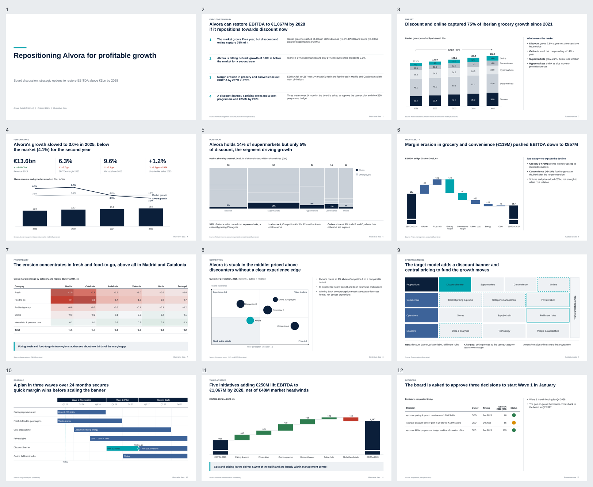

# MBBslides — Consulting Presentation Engine

[](https://github.com/diegonievesdesantos-oss/MBBslides/actions/workflows/ci.yml)
[](LICENSE)



**Raw data and documents → traceable facts → decision storyline → native PPTX → visual QA → corrected deck.**

MBBslides turns raw material into a **native, editable PowerPoint** built the way strategy
consultants build decks. Raw material means data exports, ERP and CRM extracts, documents, memos
and contradictory opinions. The engine builds the deck as follows:
- a fact model traceable to source cells, with recorded analyses of row-level data;
- tested hypotheses;
- a storyline that ends in an approvable decision (owners, amounts, dates, gates);
- one message per slide with a conclusion headline, and visuals chosen by the message.

It then renders the deck, measures its visual quality and corrects what it can. **Every number a
reader sees must come from a cited fact.** The pass/fail verdicts are computed by code.

> **v2.5.0** (current): years, long tables and cumulative figures.
> - A source value takes the year next to it; a chart point its category's year; a long table's row
>   its year column.
> - A cumulative figure is never matched to one period's, nor the other way round.
> - Blind, on a sealed synthetic set: proposed values right 72% → 76%, "outdated" flags right 81% → 83%.
> - Blind validation on real material moves to v3.0, the last version.

<!-- metrics:start (generated from evals/results/latest.json by `cpe results readme`; do not edit) -->

Independent signals, never combined into one number ([why](docs/EVALS.md)). A mean hides structure, so the regression signal is reported as a distribution across slide archetypes.

**Regression** — development suite, gates CI (relative baseline + absolute archetype gates)

| measure | value |
|---|---|
| overall (mean of decks, historical continuity) | 95.1 |
| macro archetype (each archetype weighs the same) | **94.4** |
| weakest archetype | **comparison 84.6** |
| P10 slide | **80.1** (median 98.7) |
| slides ≥ 80 / ≥ 70 | 91% / 96% |
| archetypes gate-eligible (n ≥ 8) | 17 of 17 |
| archetypes not healthy | text_exhibit |
| QA errors (visual / authoring lint) | 0 / 0 |
| slides authored · resolved · measured · decks | 199 · 202 · 202 · 28 |
| visual QA · authoring QA · benchmark | passed · passed · passed |

| other signal | what it measures | current |
|---|---|---|
| **Holdout v2** | blind result of v1.4.0 (run once); development-known since v1.5, not re-run (26 decks, 157 authored / 158 measured slides) | overall 91.4 · macro 91.8 · P10 74.5 · weakest kpi_dashboard 71.6 |
| **Robustness** | small content perturbations of development seeds (78 variants) | median drop 0.0 · P90 drop 0.0 · catastrophic 0 (0%) |
| **Human r1** | blind A/B votes (`cpe human`) | awaiting human votes — 40 blind pairs built, 0 votes |
| **Human r2** | blind A/B votes (38 votes, 1 evaluator) — development data since v1.5; blind validation of v1.4 preserved | challenger preferred 0.97 (95% CI 0.86–0.99) · scorer agrees 0.97 |
| **Human r3** | blind A/B votes (38 votes, 1 evaluator) | challenger preferred 0.90 (95% CI 0.60–0.98) · scorer agrees 0.83 |
| Holdout v1 (retired) | H01–H05, development-known since v1.3 | last blind result 81.0 (v1.2); engine e3b63e1; later runs (this v1.3 re-run included) are development evidence |
| Private corporate template — **development data, not a holdout** | brand-ingest understanding of a real corporate template (sanitized) | development data since v1.3 (its v1.2 findings drove the fixes, so it is no longer a holdout): 1 master(s), 54 layouts, 32% classified with confidence ≥ 0.5; font conflict detected; test deck QA passed; agreement with the human brand spec 21/22 |

Example decks are development material and regression fixtures, not evidence of generalization:

| example deck | QA gate | QA score | archetype-fitness composition score |
|---|---|---|---|
| `alvora` | PASSED · 0 errors · 0 warnings | 99.8 | 99.8 |
| `gallery` | PASSED · 0 errors · 0 warnings | 99.8 | 99.6 |
| `alvora_on_kestrel` | PASSED · 0 errors · 0 warnings | 99.7 | 99.5 |

<sub>engine 2.5.0 · evaluated source commit `d681e6b4c9` · LibreOffice 24.2.7.2 420(Build:2) · fontconfig 2.15.0 · container `mbbslides-visual:1.3@sha256:bb5bbbdd55bcec5db567781c63574da1a4b2fc4504446d6fea23f5197f59d278` · render fingerprint `f98cee49d123ed5f`</sub>

<!-- metrics:end -->

## What's new in v2.5 — years, long tables, cumulative figures

- **Each value its own year:** in "1,4 M€ en 2023, 1,8 M€ en 2024", each value takes its own year. A
  chart point takes its category's year, not every year of the chart's title.
- **Long tables:** in "indicador, año, valor", each value takes its row's year, so a past actual is no
  longer called outdated by another year's row.
- **Cumulative against yearly:** "inversión acumulada" is never one year's investment.
- **Measured blind,** on a sealed set of 4 synthetic cases (392 keyed numbers):
  - proposed values right: 72% → 76%;
  - "outdated" right: 81% → 83%;
  - "current" right: 67/70 → 70/72.

Details: [docs/V25_STATUS.md](docs/V25_STATUS.md).

## What's new in v2.4 — choosing the new value

- **One source value, at most two figures:** a committee's "3,5 M€" is no longer the new value of five
  different numbers. Restatements of one figure share it.
- **Years in every form:** 2025e, 2025F, FY25, FY2024/25, 2024-2025.
- **Disagreeing restatements are flagged:** with no derived or analysis value to lead them, each keeps
  its own and the review shows "restatements disagree".
- **Measured blind,** on a sealed set of 4 synthetic cases:
  - outdated found: 88/149 → 84/149;
  - proposed values right: 53% → 54%.

  These changes removed only wrong values on the development sets, but not blind.

## What's new in v2.3 — finding what changed on unseen material

- **Open measures:** a number is matched on what it counts ("socios", "applications"), an acronym (OEE,
  NPS, RevPAR) or a table cell's column, not only on ~25 known measures.
- **Captions, names, benchmarks:**
  - a table's caption names its cells' measure and unit;
  - a plant, site, fleet or hotel named next to a number must match the source's;
  - a competitive set or sector median is not the company's figure.
- **Fewer false "current":** the source must round to the deck's figure. Proposals, quotes and
  reminders ("os recuerdo", "reaffirmed") confirm nothing.
- **Safer groups:** a head must be about the measure next to it, and labelled cells about different
  things are never one figure.
- **Measured blind**, on a sealed set of 4 synthetic cases:
  - outdated numbers found: 32/206 → 82/206;
  - "outdated" flags right: 78% → 86%;
  - proposed values right: 46% (no better than before).

Details, the three sets and what did not work: [docs/V23_STATUS.md](docs/V23_STATUS.md).

## What's new in v2.2 — one figure across the deck, projections from their drivers

- **One figure, one value:** restatements of a figure across slides form a group. The group follows a
  derived figure, else an analysis output, else a table cell. A member's own different match is kept
  as an alternative.
- **Projections and curves:**
  - a series growing at a stated rate is base × (1 + rate);
  - a cumulative cash curve follows −investment + n × savings, or a source's yearly flows.
- **Conflicts:** an earlier deck on one side, or values 40% or more apart, now rank low. "Medium" goes
  from 19/50 to 18/38 real conflicts.
- **Headlines:** flipped signs ("ahorra" → "cuesta") and orders ("supera" → "no alcanza") get a
  proposal. "Tiene el mayor X" and more adjectives are checked.

Details, the blind check and its failures: [docs/V22_STATUS.md](docs/V22_STATUS.md).

## What's new in v2.1 — less review work

- **Ranked conflicts:** `cpe reason conflicts WORK` lists them by priority (high / medium / low), with
  `--dismiss ID --why …` and `--resolve ID --use FACT`. Decisions survive a re-run with new sources.
- **A review sheet:** `cpe update` writes `work/review.xlsx`; `--apply` reads it back. Problems in the
  sheet are reported, never applied.
- **More headline claims:** superlatives (with the real winner proposed), signs, orders and the
  payback year against the cumulative curve.
- **Cumulative series:** recomputed point by point when the slide shows the flows; otherwise each
  point says it cannot be recomputed from the deck.

Details and measured results: [docs/V21_STATUS.md](docs/V21_STATUS.md).

## What's new in v2.0 — update an existing deck end to end

- **`cpe update old.pptx sources/ -o work`:** one command from the old deck and new sources to
  reviewable edits.
- **`cpe update --apply work -o new.pptx`:** applies the approved edits to the original file.
- **Derived figures:** totals, net rows, payback-type ratios and repeated KPIs are found in the old deck's
  own arithmetic. They are recomputed from the approved values.
- **Release:** the release waits on blind validation by the owner (unseen templates, new cases). See
  [docs/V20_STATUS.md](docs/V20_STATUS.md).

## What's new in v1.9 — in-place update, learned layouts, tool debts

- **Update the original file:**
  - `cpe deck edits work` proposes one edit per outdated number, in the deck's own notation,
    unapproved.
  - `cpe deck patch old.pptx edits.json -o new.pptx` applies the approved ones. Formatting, tables and
    charts are kept, and each change is noted on its slide.
- **Layouts learned from slides:** when no layout of a deck has a title placeholder, brand ingest learns
  cover, statement and content layouts from the slides' geometry.
- **`deck stale`:** a number is matched on its own words, unit and period. Page numbers, codes and
  phase indices are ignored. Restatements of the old plan never confirm a number.
- **Conflicts and messy tables:**
  - prose is compared with tables, and ratios are compared;
  - title lines above a header, repeated two-level headers and `n/d` cells are read;
  - week references count as periods.
- Status and caveats: [docs/V19_STATUS.md](docs/V19_STATUS.md).

## What's new in v1.8 — real-world inputs, corporate use, any OS

- **Messy sources:** periods and bases (FY vs CY, LTM, YTD, budget vs actual, audited vs management)
  are understood and mismatches flagged. Conflicts between sources are typed. Two-level and
  total-row tables are read, and so are charts embedded in Word, Excel and PowerPoint files.
- **Update an existing deck:** `cpe deck ingest old.pptx -o work`, then `cpe deck stale work`. Each
  old number is current, outdated (with the new value and its source) or untraced.
  Since 1.9, `cpe deck edits` and `cpe deck patch` change the original file in place: only the approved
  numbers change, and everything else stays as it was.
- **Cell-to-fact binding:** a real number in the wrong cell is caught.
- **New visuals:** cause → effect; timeline + decisions table; explicit n/a.
- **Corporate templates:** a per-slide report says whether the template's own layout was used
  (native / adaptive / engine fallback) and why. Brand-fidelity metrics are reported separately.
- **Windows, macOS, Linux:** see [docs/INSTALL.md](docs/INSTALL.md).

- **Reasoning protocol 1.5:** five rules from the owner's blind review of the first real-project update.
  The rules require:
  - a contingency on investments;
  - renegotiate and defer as options, so the supplier's deadline does not decide;
  - gates with margin and a sustained test;
  - discarded evidence stays discarded;
  - coherent supporting figures.

  Each rule is checked as a warning.

Status, and what still needs real templates, real projects and the owner's judgement:
[docs/V18_STATUS.md](docs/V18_STATUS.md).

## What's new in v1.7 / 1.7.1: from raw material to a decision deck

v1.7 moves upstream of rendering, to building the **right** deck. The agent may write hypotheses,
insights and wording; **it never creates a fact**. Every artifact it writes is checked by code
([docs/REASONING_PROTOCOL.md](docs/REASONING_PROTOCOL.md), protocol 1.5).

- **Fact model** (`cpe reason facts`):
  - reads Excel, CSV, PDF, Word and markdown, including decimal-comma documents and messy tables;
  - each fact has its value, unit, period, basis and exact location;
  - fact ids stay stable across extractor versions;
  - conflicting sources are listed for resolution.
- **Row-level data** (`cpe reason analyze`): the agent's analysis scripts run twice and their inputs
  and outputs are hashed; their tables become citable facts. Stale or non-reproducible analyses
  block the deck.
- **Reasoning artifacts with deterministic checks:**
  - business question, hypotheses and insights;
  - storyline with a **decision frame**: target, quantified levers, gap, current plan tested,
    options costed on the same basis, approvable asks, gates, KPIs;
  - deck plan, ghost deck, five critics, stopping criteria.
- **Hard factuality gates.** The deck is blocked when:
  - a fact is fabricated (checked against the raw files);
  - a number is unsupported anywhere on a slide: headline, text, KPI, **table cell**, **chart value**;
  - the source is wrong, or there is an arithmetic error;
  - a claim rests on a rejected hypothesis.
  
  Dates, deadlines and durations are never checked: **traceability never costs the reader content**.
- **Decision-deck visuals:**
  - estimates and upper bounds marked on the number itself (`~2,0`, `≤4,5`);
  - waterfall target lines, muted bridges with a highlight, KPI + commentary layouts;
  - native Spanish number formats, including chart labels (`meta.language`).
- `cpe reason trace` explains any sentence down to source cells; `cpe reason eval` benchmarks
  grounding, insight, storyline, architecture, headlines and visual intent separately
  ([docs/SOURCE_TO_DECK.md](docs/SOURCE_TO_DECK.md)).

**Human evidence for the reasoning layer** (one expert rater, blind storyline A/B, protocol vs the
same agent without it). External cases are kept private; only aggregates are published.

| round | cases | result |
|---|---|---|
| s1 | 4 development | 2–2 → decision frame (protocol 1.1) |
| s2 | 4 harder development | **3–1 for the protocol** → options on the same basis (1.2) |
| s3 | 1 external business case | **1–0 for the protocol** |
| s4 | 5 external raw-data cases | 1–4 against protocol 1.3 → "traceability never costs content" (1.4) |
| acceptance | 1 external raw-data case, end to end, protocol 1.4 | 8-slide Spanish board deck, reasoning PASS, QA 0 errors, deck 98.1; judged "perfect" |

Protocol 1.4 has not yet been through a blind multi-case round. Open items are in
[docs/DEBT_V17.md](docs/DEBT_V17.md). Experiments: [S2D_EXPERIMENT_01](docs/S2D_EXPERIMENT_01.md),
[S2D_EXPERIMENT_02](docs/S2D_EXPERIMENT_02.md).

## Status

`main` and the `release/v1.7.1` branch (`release/v1.7.0`, `release/v1.6.0rc1` before it).
External evidence still awaited, from v1.6:
- an externally authored slide holdout;
- an unseen corporate template;
- more human raters ([docs/EXTERNAL_HOLDOUT_PROTOCOL.md](docs/EXTERNAL_HOLDOUT_PROTOCOL.md),
  [docs/HUMAN_EVALUATORS.md](docs/HUMAN_EVALUATORS.md)).

## What's new in v1.5 (release candidate) — human alignment and real failure modes

A small release driven by the first blind human round (r2: one evaluator preferred v1.4 in 35 of
36 decisive votes). **v1.5.0rc1 awaits external validation**: an externally authored holdout, an
unseen corporate template and human round r3 can only come from someone else
([docs/EXTERNAL_HOLDOUT_PROTOCOL.md](docs/EXTERNAL_HOLDOUT_PROTOCOL.md)).

- r2 preserved as the single-rater blind validation of v1.4, then marked development data; process
  and comparison profiles now `human_supported_single_rater`, KPI dashboards still provisional.
- **KPI dashboards** diagnosed ([docs/KPI_DASHBOARD_DIAGNOSIS.md](docs/KPI_DASHBOARD_DIAGNOSIS.md)):
  the metric misread separators and card panels; the engine now arranges cards by measured width
  and keeps every figure legible on its card.
- **Derived-number proof**: "€61M" over 24 + 19 + 18, "−18%" over 100 → 82 — deterministic,
  unit-aware, conservative (ambiguous = unproven), with provenance.
- **Waterfalls below zero** and **long statements** render inside their zones.
- Visual / authoring / benchmark QA verdicts apart; robustness drop distribution and instability
  rates; private keys for future human rounds; clearer provenance.

## What's new in v1.4 — generalisation and visual intelligence

The question of this release: *does MBBslides make good editorial decisions on slides it has never
been tuned on?* A single mean could not answer it (87.5 overall hid process and comparison slides
at 39 and text slides at 20–30), so:

- **Distribution-aware quality profile** in every eval: macro-archetype score, weakest archetype,
  P10…P90, coverage per archetype, health, **absolute archetype gates** on top of the relative
  baseline, and a per-metric **penalty attribution** for every score.
- **Balanced development battery**: 17 decks, 8–12 slides per archetype, English and Spanish,
  sparse and dense, stress variants. Weak archetypes diagnosed metric-by-metric
  ([docs/ARCHETYPE_DIAGNOSIS.md](docs/ARCHETYPE_DIAGNOSIS.md)) and fixed in the engine first:
  adaptive vertical composition for text, process, comparison, KPI and gantt components.
- **Metamorphic robustness** suite: small content changes must not collapse quality.
- **Sealed holdout v2**: 26 new decks sealed before any v1.4 change and run once on the frozen
  engine; the old holdout is retired as blind evidence.
- **Human round r2** ready for votes; scorer-vs-human agreement, Kendall τ-b and a disagreements
  report; no vote is ever generated.
- **Provenance**: every recorded number declares the clean commit it was evaluated on; CI checks it.
- Archetype profiles moved to governed data with rationale and a changelog
  ([evals/profile_changes.md](evals/profile_changes.md)).

See [CHANGELOG.md](CHANGELOG.md) and [docs/EVALS.md](docs/EVALS.md).

## What's new in v1.3

Corporate templates are read through PowerPoint's inheritance chain: the font and colour text is
really drawn in (not what the theme declares), weight-named families merged, page and text colours
from what the template draws, grid from its content layouts, closings learned from use, and
deck-level brand advice (bookend, share of brand-colour slides). Open-licence corporate typefaces
(Inter, Roboto, Open Sans, Lato, Montserrat) are in the visual environment. See
[CHANGELOG.md](CHANGELOG.md).

## What's new in v1.2

- **Reproducible benchmark.** One pinned visual environment (`docker/Dockerfile`: base image by
  digest, Ubuntu archive snapshot, exact LibreOffice / fontconfig / FreeType / HarfBuzz / FriBiDi /
  font versions, locked Python packages) used locally (`scripts/cpe-docker`) and in CI. Every eval
  records an environment manifest and render fingerprint; `cpe repro` renders twice and requires
  pixel-identical output. CI runs on `ubuntu-24.04` with Node 24 actions pinned to SHAs.
  [docs/REPRODUCIBILITY.md](docs/REPRODUCIBILITY.md)
- **Archetype-aware composition.** A statement slide should breathe; a table should not float in
  half an empty slide. 17 archetypes, each with an expected visual profile; the composition score is
  now *fitness to the archetype*. Composition is editorial advice, separate from hard QA; candidate
  selection names layouts that are "technically compatible but inappropriate for this content
  volume". [docs/COMPOSITION_SCORING.md](docs/COMPOSITION_SCORING.md)
- **Three separate evaluation signals.** Regression (development set, gates CI) ≠ holdout (sealed
  unseen cases + private corporate templates, reported, never tuned on) ≠ human preference (a blind
  A/B tool with Wilson intervals and inter-rater agreement). Never merged into one number.
  [docs/EVALS.md](docs/EVALS.md)
- **Corporate template intelligence.** `cpe brand ingest` reads every master, classifies every
  layout by geometry and by how the example slides use it, infers typography (theme vs actual
  usage, with conflicts), palette, grid, logos and brand rules, and generates slides on the
  template's own layouts (native → adaptive → fallback). [docs/BRAND_INGESTION.md](docs/BRAND_INGESTION.md)
- `evals/results/latest.json` is the single source of truth: the table above is generated from it.

v1.1 introduced the composition metrics, the composition engine, `cpe eval` and brand ingestion;
see [CHANGELOG.md](CHANGELOG.md).

## How it works

```
SOURCES → FACTS (+ recorded analyses) → QUESTION → HYPOTHESES → INSIGHTS → STORYLINE + DECISION FRAME
        → DECK PLAN → CRITICS → reason check (hard factuality gates)
INPUT → UNDERSTAND → STORYLINE → SLIDE INTENT → VISUAL ENCODING → LAYOUT CANDIDATES
      → COMPOSITION CANDIDATES → RENDER → COMPOSITION SCORING → BEST CANDIDATE
      → PPTX → RENDER → QA (content · geometry · render · composition) → PATCH → FINAL PPTX
```

- **Thinking before rendering.** Nothing is drawn without a *slide intent* (purpose, headline,
  message type, evidence). The storyline is an explicit object (governing thought + key line +
  framework), and you can check it by reading the headlines alone (the *ghost deck*).
- **Verified headlines.** Topic titles and double messages are rejected. Every number in a
  headline must be derivable from the evidence or the exhibit data.
- **Explainable visual reasoning.** 20 message types × data shape → visual, with the why and the
  why-not recorded.
- **Real QA.** Geometry is checked with real font metrics and compared with what LibreOffice
  actually draws; then comes composition scoring and a guided semantic review. The engine fixes
  form on its own; anything that needs rewording comes back as a concrete author action.

## Installation

```bash
git clone https://github.com/diegonievesdesantos-oss/MBBslides && cd MBBslides
pip install -r requirements.txt            # python-pptx, Pillow, lxml, PyMuPDF, openpyxl
# rendering: LibreOffice with Impress + metric-compatible fonts
sudo apt-get install -y libreoffice-impress fonts-liberation fonts-crosextra-carlito fonts-crosextra-caladea
# macOS: brew install --cask libreoffice
pip install pytest && python -m pytest -q
```

Reproducible renders (recommended for benchmarks): `scripts/cpe-docker <command>` runs the same
pinned environment as CI (Docker required; the image is built on first use).

Optional: `pip install -e .` installs the `cpe` command. Without installing: `scripts/cpe <command>`
(Linux / macOS) or `.\scripts\cpe.ps1 <command>` (Windows). Windows and macOS steps:
[docs/INSTALL.md](docs/INSTALL.md); building, reasoning and deck updates need no LibreOffice.

## Quick start

```bash
scripts/cpe ingest notes.md data.xlsx report.pdf -o work/inventory.json      # 1. understand the input
scripts/cpe scaffold --deck-type board_presentation --title "…" -o deck.json  # 2. storyline skeleton
#   … the agent writes the governing thought, key line and each slide's intent (SKILL.md §2–§5)
scripts/cpe outline deck.json               # 3. ghost deck: does the story hold from the headlines alone?
scripts/cpe lint deck.json                  # 4. intents, headlines, numbers, visuals, density
scripts/cpe run deck.json -o out/           # 5. compose → pptx → render → QA → autofix (≤3 rounds)
#   review out/contact_sheet.png, out/composition.md and out/review.md; write review.json / patches.json
scripts/cpe review out/review.json          # 6. semantic visual review
scripts/cpe patch deck.json patches.json && scripts/cpe run deck.json -o out/   # 7. iterate
```

From raw material (reasoning protocol 1.4, [docs/REASONING_PROTOCOL.md](docs/REASONING_PROTOCOL.md)):

```bash
scripts/cpe reason facts case/sources -o case/work                  # traceable fact model (+ datasets listed)
scripts/cpe reason analyze case/work scripts/by_store.py --sources case/sources   # row-level data → citable tables
scripts/cpe reason facts case/sources -o case/work                  # re-run: analysis outputs become facts (ids kept)
#   … the agent writes project, hypotheses, insights, computed facts, storyline (+ decision frame), deck plan, critique
scripts/cpe reason check case/work --sources case/sources           # every artifact + hard factuality gates
scripts/cpe reason ghost case/work                                  # the argument from headlines alone
#   … the agent writes deck.json citing fact ids in evidence
scripts/cpe reason check case/work --sources case/sources --enrich  # every number on every slide grounded
scripts/cpe run case/work/deck.json -o out/                         # render + visual QA as below
scripts/cpe reason trace case/work "Cerrar los tres restaría 158 k€"  # why is this sentence in the deck?
```

Corporate identity:

```bash
scripts/cpe brand ingest corporate.pptx -o brands/acme     # theme.json + compatibility.md
# in deck.json:  "meta": {"brand": "brands/acme", …}
```

Evaluation (three separate signals, [docs/EVALS.md](docs/EVALS.md)):

```bash
scripts/cpe-docker eval --suite regression        # development set vs baseline (exit 1 on regression)
scripts/cpe-docker eval --suite regression --update-baseline --record   # accept an intended change
scripts/cpe-docker eval --suite holdout --record  # sealed unseen cases: reported, never baselined
scripts/cpe holdout private                       # corporate templates in .private/ (git-ignored)
scripts/cpe human serve evals/human_reference/rounds/r1   # blind A/B page on localhost
scripts/cpe human report evals/human_reference/rounds/r1 --record
scripts/cpe repro examples/alvora/deck.json       # render twice, require identical output
scripts/cpe results readme                        # regenerate the metrics table from latest.json
scripts/cpe measure out/                          # composition metrics of any existing run
```

Other commands: `plan`, `build`, `render`, `qa`, `recommend <message_type>`, `catalog`, `themes`.

## Examples

- **[`examples/alvora/`](examples/alvora/)**: the end-to-end test deck. `deck_draft.json` is a
  first draft with real problems (bars with time on the vertical axis, commentary that is too
  long, a topic headline, an over-long double-message headline, a missing source). `output/1_draft/`
  shows the loop: the engine fixes form on its own and returns 5 author actions that require rewriting.
  `agent_patches.json` holds the agent's corrections; applied to `deck.autofixed.json` they
  reproduce `deck.json` (plus the engine's recorded composition choices). The final result is in
  `output/2_final/`: PPTX, PDF, one PNG per slide, QA report, composition decisions and visual
  review.
- **[`examples/brand/`](examples/brand/)**: the same deck generated on a fictitious corporate
  template (Kestrel Capital: Georgia/Calibri, its own colours, a logo and a bar on the master),
  with the ingestion's compatibility report.
- **[`examples/gallery/`](examples/gallery/)**: 26 slides exercising every exhibit type, the
  structural slides and the `harbor` theme.

## Languages

Code and documentation are in English. The engine is **bilingual (English / Spanish)** for content:
the headline lint (verbs, topic nouns, vague words), the number check (durations and identifiers
such as "24 months" / "24 meses", "wave 1" / "fase 1", decimal commas such as "4,1%"), the storyline
lint and the ingestion number parser understand both languages. Documents written with decimal
commas are detected, and dates are never read as quantities. With `meta.language: "es"`, every number
in the deck is formatted the Spanish way (1.066,5 · 2,67x), chart labels included.

## Deck types

strategy deck · business review · investment memo · board presentation · market analysis ·
commercial due diligence · transformation program · operating model · product strategy ·
financial analysis · sales strategy · implementation roadmap · executive update ·
project steering committee. Each has a default storyline framework, slide archetypes and a
density profile (board / standard / analytical / status). Themes: `meridian`, `graphite`,
`harbor`, or any ingested brand.

## Documentation

| | |
|---|---|
| [SKILL.md](SKILL.md) | the agent's operating manual |
| [ARCHITECTURE.md](ARCHITECTURE.md) | architecture, modules, implementation decisions, how to extend |
| [AUDIT.md](AUDIT.md) · [docs/audit/](docs/audit/) | audit of the 4 reference skills, capability matrix, decisions |
| [CHANGELOG.md](CHANGELOG.md) | release notes |
| [docs/VISUAL_GUIDE.md](docs/VISUAL_GUIDE.md) | every exhibit type, its data shape and rules |
| [docs/SPEC_REFERENCE.md](docs/SPEC_REFERENCE.md) | deck spec and patch reference |
| [docs/LAYOUT_CATALOG.md](docs/LAYOUT_CATALOG.md) | 44 layouts in 16 families |
| [docs/QA_CODES.md](docs/QA_CODES.md) | every QA code, its severity and remedy |
| [docs/EVALS.md](docs/EVALS.md) | quality profile, absolute gates, robustness, sealed holdout v2 protocol, human A/B statistics |
| [docs/COMPOSITION_SCORING.md](docs/COMPOSITION_SCORING.md) | archetypes, expected profiles, fitness, attribution, profile governance, hard QA vs preference |
| [docs/ARCHETYPE_DIAGNOSIS.md](docs/ARCHETYPE_DIAGNOSIS.md) | v1.4 weak-archetype diagnosis: metric vs engine decisions, engine-vs-scorer on the holdout |
| [docs/KPI_DASHBOARD_DIAGNOSIS.md](docs/KPI_DASHBOARD_DIAGNOSIS.md) | v1.5 KPI-dashboard study: the r2 disagreement, engine vs metric, before/after |
| [docs/EXTERNAL_HOLDOUT_PROTOCOL.md](docs/EXTERNAL_HOLDOUT_PROTOCOL.md) | how to hand over an external holdout or an unseen corporate template |
| [docs/BRAND_INGESTION.md](docs/BRAND_INGESTION.md) | corporate template intelligence and layout matching |
| [docs/REASONING_PROTOCOL.md](docs/REASONING_PROTOCOL.md) | reasoning protocol 1.4: artifacts, passes, decision frame, critics, hard gates |
| [docs/SOURCE_TO_DECK.md](docs/SOURCE_TO_DECK.md) | source-to-deck benchmark and human evaluation of storylines |
| [docs/S2D_EXPERIMENT_02.md](docs/S2D_EXPERIMENT_02.md) | experiments, human rounds s2–s4, end-to-end decks, acceptance test |
| [docs/DEBT_V17.md](docs/DEBT_V17.md) | open findings after v1.7.1 |
| [docs/REPRODUCIBILITY.md](docs/REPRODUCIBILITY.md) | pinned environment, manifest, reproducibility test, provenance and release workflow, CI |
| [evals/](evals/) | the suites, baseline and results |

## Troubleshooting

| Symptom | Cause / fix |
|---|---|
| `RENDER_UNAVAILABLE`, "source file could not be loaded" | The Impress component is missing: `apt-get install libreoffice-impress`. Meanwhile `cpe run --no-render` still runs the geometry QA (no composition engine). |
| Rendering is slow or hangs | Another LibreOffice instance is running: the engine uses a temporary profile per conversion; kill stray instances (`pkill soffice`). |
| Text widths differ from PowerPoint | Install the fonts (or their metric twins: Liberation for Arial/Times, Carlito for Calibri, Caladea for Cambria). The brand report says which fonts are measured exactly and which only approximately. |
| `cpe eval` fails after an intended change | Read `eval_report.md`; if the change is intended, run `cpe eval --update-baseline` and commit the new baseline with the change. |
| `COMPOSITION_*` in "Editorial advice" | A preference, not a QA defect (the verdict is unaffected): the composition does not fit what the slide is (e.g. a table using half the slide). Add the proof, merge the slide or accept it. |
| `FONT WARNING` in the brand report | The corporate font is not installed here: text is measured and rendered with a substitute. Install the font or accept approximate line breaks. |
| Scores differ from CI / the README | Run through `scripts/cpe-docker`; `eval_report.md` names what differs in the environment. |
| `BRAND_RESERVED_OVERLAP` | Content covers the template's logo or artwork: shorten the element or pick another layout. |
| `HEADLINE_NUMBER_UNSUPPORTED` | The headline number does not come from the data: add `evidence[].value(s)` or correct the number. |
| `CONTENT_OVER_CAPACITY` | The text does not fit even at the minimum size: cut the indicated number of words or split the slide. |
| PowerPoint offers to "repair" the PPTX | Keep the `deck.json` and reproduce it: the tests reopen every PPTX with python-pptx, but PowerPoint is stricter than LibreOffice about XML ordering. |

## Known limitations

- Verification rendering uses LibreOffice; PowerPoint may break lines slightly differently.
- Brand templates must be 16:9 for their masters to be used (10 in pages are rescaled). Other
  ratios get colours and fonts only, and the report says so.
- Brand inference has been validated on one real corporate template (which is now development
  data) and on synthetic templates; an unseen corporate template is awaited
  (`.private/holdouts/corporate_unseen/<name>/`).
- Derived-number proof covers bounded single-series arithmetic only; figures that need several
  exhibits, subsets or text-stated numbers stay unproven (by design).
- Human evidence comes from **one expert rater** by design (owner decision): r2 and r3 are blind
  results of that rater, both now development data. Between-rater agreement is not measured.
- Holdout v2 was written by the same agent that develops the engine and is development-known since
  v1.5; no externally authored holdout exists yet (`.private/holdouts/external/`).
- KPI dashboards: the engine and the metric were fixed on development data; their profile is still
  provisional and only r3 can say whether the corrected scores match human judgement.
- Maps are editable *tile maps* (cartograms), not choropleth maps with real borders.
- Composition fitness is a heuristic calibrated on the development set; the holdout, the 2×2
  engine-vs-scorer comparison and the human A/B rounds exist to tell how well it generalises. It
  does not replace a visual review.
- Storyline quality depends on the agent; the engine structures and checks it, it does not invent it.
- Reasoning protocol 1.4 was accepted on one real case, not in a blind multi-case round. Human
  evidence for the reasoning layer is one rater over small rounds (s1–s4).
- A table cell holding a real cited value in the wrong row or column is not caught; cell-to-fact
  binding is planned for v1.8 ([docs/DEBT_V17.md](docs/DEBT_V17.md)).

## License

Apache License 2.0; see [LICENSE](LICENSE) and [NOTICE](NOTICE).
