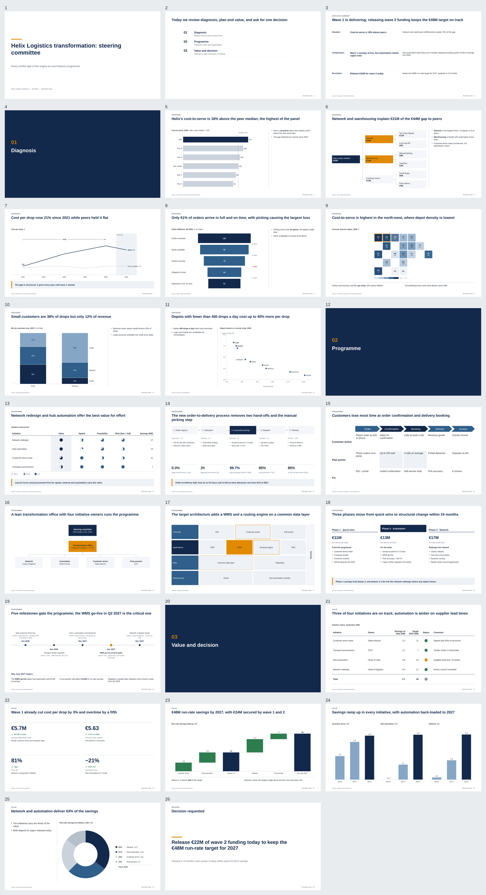

# MBBslides

**Consulting-grade PowerPoint decks from raw material — storyline first, every number traced, every slide checked.**

[](https://github.com/diegonievesdesantos-oss/MBBslides/actions/workflows/ci.yml)
[](LICENSE)


MBBslides is an open-source presentation engine and a **Claude skill**. You (or an AI agent) decide
what the deck must say; the engine builds a **native, fully editable `.pptx`** the way strategy
consultants do, renders it, inspects what was actually drawn, fixes what it can and tells you
exactly what it cannot.

It is built around four rules that most slide generators break:

1. **Think before drawing.** A deck starts as a storyline — a one-sentence answer, the arguments that
   prove it, and one message per slide. Nothing is rendered until every slide has a purpose, a
   proposition, evidence and a conclusion headline.
2. **No number without a source.** Every figure a reader sees must trace back to a cited fact or be
   derivable from the slide's own data. Invented numbers block the deck.
3. **Headlines state conclusions.** "Revenue evolution" is rejected; "Revenue grew 12% in 2026,
   driven by enterprise customers" is accepted only if the evidence and the claim type support it.
4. **The render is the truth.** Quality is checked on the slides LibreOffice actually draws — overlaps,
   overflow, line breaks, composition — not on what the code intended.

The pass/fail verdicts are computed by code, reported separately (factual, editorial, visual,
authoring, brand) and never averaged into one flattering number.

## Contents

- [What it can do](#what-it-can-do)
- [Use it as a Claude skill](#use-it-as-a-claude-skill)
- [Install the CLI](#install-the-cli)
- [Quick start](#quick-start)
- [How it works](#how-it-works)
- [Examples](#examples)
- [How good is it? Measured, not claimed](#how-good-is-it-measured-not-claimed)
- [Limitations](#limitations)
- [Documentation](#documentation)
- [Contributing](#contributing) · [License](#license)

## What it can do

| | |
|---|---|
| **Build a deck from raw material** | Reads Excel, CSV, PDF, Word and Markdown (decimal commas and messy tables included) into a fact model where every value keeps its unit, period, basis and exact source location. Row-level data (orders, CRM, ledgers) is aggregated by recorded, re-run, hashed analysis scripts. |
| **Reason about the business** | Business question → hypotheses → insights → storyline with a decision frame (levers that add up, options costed on the same basis, approvable asks, gates and KPIs). Deterministic checks block invented facts, wrong sources, arithmetic errors and claims resting on rejected hypotheses. |
| **Write the storyline** | Pyramid principle with 7 narrative frameworks (SCR, Problem → Drivers → Solution, Hypothesis → Evidence → Conclusion…) and 14 deck types (board, strategy, CDD, investment memo, transformation, steering committee…). A ghost deck lets you read the argument from the headlines alone. |
| **Guarantee the wording** (v3.1) | Each slide carries a **proposition** — what it asserts, with the evidence that proves it. The **Action Title Engine** accepts a headline only if it states that proposition without changing its direction, magnitude, entity, scope, period, confidence or causal strength, and fails closed otherwise. The **Parallel Wording Guarantee** keeps sibling messages (recommendations, process steps, options, executive-summary points) in one grammatical form, in English and Spanish. |
| **Choose the visual from the message** | 21 message types × data shape → 49 exhibit types: native charts (waterfall, bridge, mekko, combo, slope…), tables (harvey balls, heatmaps, scorecards) and diagrams (driver trees, 2×2s, gantts, process flows, org charts, operating models), with the reasoning recorded. |
| **Lay it out like a consultant** | 45 grid layouts in 16 families, a density engine that cuts, switches layout or splits before it shrinks text below the floor, and archetype-aware composition scoring that renders candidates and keeps the best. |
| **Check the rendered slides** | Geometry with real font metrics, render checks on the PDF and PNGs, composition, editorial QA, and an automatic patch loop. What needs rewording comes back as a precise author action. |
| **Use your corporate template** | `cpe brand ingest template.pptx` learns masters, layouts, fonts, palette, grid and logos, then builds on the template's own layouts, with a per-slide report of what was native, adapted or fallback. |
| **Update an existing deck** | Old `.pptx` + new sources → every number classified current / outdated / untraced, derived totals recomputed, headlines whose message no longer holds flagged — and the approved edits applied **to the original file**, keeping its formatting. Nothing changes without a person's approval. |

Content is bilingual: **English and Spanish** (headline rules, number formats such as `1.066,5`,
verb detection, durations and identifiers). Output is a standard `.pptx` you can edit in PowerPoint: charts are native charts with their data,
tables are tables and diagrams are editable shapes.

## Use it as a Claude skill

The repository root is a skill: [`SKILL.md`](SKILL.md) is the operating manual the agent follows
(storyline, slide intents, propositions, headlines, visuals, the render → QA → patch loop).

**Claude Code**

```bash
git clone https://github.com/diegonievesdesantos-oss/MBBslides ~/.claude/skills/mbbslides
pip install -r ~/.claude/skills/mbbslides/requirements.txt
# for rendering and visual QA (recommended): LibreOffice with Impress — see "Install the CLI"
```

Then ask for what you need, for example: *"Turn `q3_review.xlsx` and `notes.md` into a 10-slide board
deck that recommends whether to open the second plant"*, or *"Update `deck_2025.pptx` with the figures
in `sources/`"*. Claude loads the skill, writes the deck spec, runs the engine and iterates on its
QA report. You get the `.pptx`, a PDF, one PNG per slide and the reports.

**Other agents and tools** can use the same manual and CLI: everything goes through
`scripts/cpe <command>` and plain JSON files.

Without LibreOffice the engine still builds the `.pptx` and runs content, editorial and geometry QA
(`--no-render`); render-based checks and composition scoring need LibreOffice.

## Install the CLI

```bash
git clone https://github.com/diegonievesdesantos-oss/MBBslides && cd MBBslides
pip install -r requirements.txt                 # python-pptx, Pillow, lxml, PyMuPDF, openpyxl
# rendering (Ubuntu/Debian): LibreOffice Impress + metric-compatible fonts
sudo apt-get install -y libreoffice-impress fonts-liberation fonts-crosextra-carlito fonts-crosextra-caladea
# macOS: brew install --cask libreoffice
python -m pytest -q                              # optional: the test suite
```

Run commands with `scripts/cpe <command>` (Linux/macOS), `.\scripts\cpe.ps1 <command>` (Windows), or
`pip install -e .` to get a `cpe` command. Windows and macOS details: [docs/INSTALL.md](docs/INSTALL.md).
For pixel-identical renders across machines, `scripts/cpe-docker <command>` runs the pinned environment
used in CI ([docs/REPRODUCIBILITY.md](docs/REPRODUCIBILITY.md)).

## Quick start

**A new deck from a storyline**

```bash
scripts/cpe scaffold --deck-type board_presentation --title "Plant 2 decision" -o deck.json
#   fill in the governing thought, key line and each slide's purpose, proposition, evidence, headline
scripts/cpe outline deck.json            # the ghost deck: does the argument hold from the headlines alone?
scripts/cpe editorial check deck.json    # propositions, action titles, parallel wording, horizontal logic
scripts/cpe lint deck.json               # intents, numbers, visuals, density
scripts/cpe run deck.json -o out/        # compose → pptx → render → QA → autofix (≤ 3 rounds)
```

`out/` then holds `deck.pptx`, `deck.pdf`, `renders/`, `contact_sheet.png`, `qa_report.md`,
`editorial_report.md`, `headline_strip.md` and a visual review packet.

A slide in `deck.json` looks like this:

```json
{
  "id": "s06", "section": "K2",
  "purpose": "Explain what drove the EBITDA decline",
  "proposition": {"statement": "Margin erosion in grocery and convenience (€119M) pushed EBITDA down from €924M to €857M",
                  "role": "driver", "claim_type": "driver", "direction": "down", "magnitude": "€119M",
                  "timeframe": "2025", "evidence_ids": ["E06-1"], "confidence": "high"},
  "headline": "Margin erosion in grocery and convenience (€119M) pushed EBITDA down to €857M",
  "message_type": "change_bridge",
  "evidence": [{"id": "E06-1", "claim": "EBITDA 2024 €924M to 2025 €857M", "values": [924, 857]}],
  "visual": {"type": "waterfall", "data": {"steps": ["…"]}},
  "source": "Management accounts"
}
```

**From raw business material** ([docs/REASONING_PROTOCOL.md](docs/REASONING_PROTOCOL.md))

```bash
scripts/cpe reason facts case/sources -o case/work                          # traceable fact model
scripts/cpe reason analyze case/work my_analysis.py --sources case/sources  # row-level data → citable tables
scripts/cpe reason check case/work --sources case/sources                   # hard factuality gates
scripts/cpe reason trace case/work "Closing the three stores saves €158k"   # why is this sentence true?
```

**Update an existing deck** ([docs/GUIA_ACTUALIZAR_DECK.md](docs/GUIA_ACTUALIZAR_DECK.md), in Spanish)

```bash
scripts/cpe update old.pptx new_sources/ -o work      # proposals in work/review.xlsx, nothing approved
#   approve, correct or dismiss each change in the spreadsheet
scripts/cpe update --apply work -o new.pptx --mark     # applies only the approved edits to the original file
```

**On your corporate template**

```bash
scripts/cpe brand ingest corporate.pptx -o brands/acme   # theme + compatibility report
#   then in deck.json: "meta": {"brand": "brands/acme", …}
```

## How it works

```
SOURCES → FACT MODEL → ANALYSIS → HYPOTHESES / INSIGHTS → STORYLINE (+ decision frame)
        → SLIDE INTENT → PROPOSITION → ACTION TITLE ENGINE → PARALLEL WORDING → EDITORIAL QA
        → VISUAL ENCODING → LAYOUT + COMPOSITION CANDIDATES → NATIVE PPTX → RENDER
        → QA (factual · editorial · geometry · render · composition · brand) → PATCH → FINAL PPTX
```

- **Thinking and rendering are separated by a JSON contract** (`deck.json`). The agent reasons;
  the engine draws and checks. Every change is a patch to the spec, so results are reproducible,
  diffable and auditable.
- **Wording is settled before layout.** The editorial layer runs before composition and planning, so
  layouts are chosen for the final headline, and visual autofix can never rewrite a claim.
- **Deterministic core.** The engine needs no language model: candidate wording comes from the agent;
  acceptance, rejection and every QA verdict are computed.

Architecture: [ARCHITECTURE.md](ARCHITECTURE.md). Editorial layer: [docs/EDITORIAL_LAYER.md](docs/EDITORIAL_LAYER.md).

## Examples

| | |
|---|---|
| [`examples/alvora/`](examples/alvora/) | A fictitious retailer's board deck. `deck_draft.json` has real mistakes (a topic headline, a double message, a missing source, an awkward chart); `output/1_draft/` shows what the engine fixes on its own and the author actions it returns; `output/2_final/` is the corrected deck with every report. |
| [`examples/gallery/`](examples/gallery/) | 26 slides of a fictitious steering committee exercising every exhibit type and the `harbor` theme. |
| [`examples/brand/`](examples/brand/) | The Alvora deck generated on a fictitious corporate template, with the template-compatibility report. |



## How good is it? Measured, not claimed

Every number below is generated from [`evals/results/latest.json`](evals/results/latest.json) and
was evaluated on a clean commit in a pinned rendering environment; CI fails if the table and the
file disagree. Signals are kept apart on purpose ([docs/EVALS.md](docs/EVALS.md)): development sets
show the engine works where it was built; **sealed holdouts**, written by independent authors and
run once, show how it generalises — and they are lower, as they should be.

<!-- metrics:start (generated from evals/results/latest.json by `cpe results readme`; do not edit) -->

Independent signals, never combined into one number ([why](docs/EVALS.md)). A mean hides structure, so the regression signal is reported as a distribution across slide archetypes.

**Regression** — development suite, gates CI (relative baseline + absolute archetype gates)

| measure | value |
|---|---|
| overall (mean of decks, historical continuity) | 95.1 |
| macro archetype (each archetype weighs the same) | **94.4** |
| weakest archetype | **comparison 84.6** |
| P10 slide | **80.1** (median 98.7) |
| slides ≥ 80 / ≥ 70 | 91% / 96% |
| archetypes gate-eligible (n ≥ 8) | 17 of 17 |
| archetypes not healthy | text_exhibit |
| QA errors (visual / authoring lint) | 0 / 0 |
| slides authored · resolved · measured · decks | 199 · 202 · 202 · 28 |
| visual QA · authoring QA · benchmark | passed · passed · passed |

| other signal | what it measures | current |
|---|---|---|
| **Holdout v2** | blind result of v1.4.0 (run once); development-known since v1.5, not re-run (26 decks, 157 authored / 158 measured slides) | overall 91.4 · macro 91.8 · P10 74.5 · weakest kpi_dashboard 71.6 |
| **Robustness** | small content perturbations of development seeds (78 variants) | median drop 0.0 · P90 drop 0.0 · catastrophic 0 (0%) |
| **Editorial (dev)** | v3.1 editorial fixtures, development set (used while building: in-sample), 210 cases | agreement 100% · valid accepted 100% · invalid caught 99% · unsupported claims passed 0/49 · parallel 100% |
| **Editorial holdout** | sealed editorial fixtures, independent author, run once (v3.1.0), 111 cases | agreement 93% · valid accepted 98% · invalid caught 88% · unsupported claims passed 3/26 · parallel 92% |
| **Human r1** | blind A/B votes (`cpe human`) | awaiting human votes — 40 blind pairs built, 0 votes |
| **Human r2** | blind A/B votes (38 votes, 1 evaluator) — development data since v1.5; blind validation of v1.4 preserved | challenger preferred 0.97 (95% CI 0.86–0.99) · scorer agrees 0.97 |
| **Human r3** | blind A/B votes (38 votes, 1 evaluator) | challenger preferred 0.90 (95% CI 0.60–0.98) · scorer agrees 0.83 |
| Holdout v1 (retired) | H01–H05, development-known since v1.3 | last blind result 81.0 (v1.2); engine e3b63e1; later runs (this v1.3 re-run included) are development evidence |
| Private corporate template — **development data, not a holdout** | brand-ingest understanding of a real corporate template (sanitized) | development data since v1.3 (its v1.2 findings drove the fixes, so it is no longer a holdout): 1 master(s), 54 layouts, 32% classified with confidence ≥ 0.5; font conflict detected; test deck QA passed; agreement with the human brand spec 21/22 |

Example decks are development material and regression fixtures, not evidence of generalization:

| example deck | QA gate | QA score | archetype-fitness composition score |
|---|---|---|---|
| `alvora` | PASSED · 0 errors · 0 warnings | 99.8 | 99.8 |
| `gallery` | PASSED · 0 errors · 0 warnings | 99.8 | 99.6 |
| `alvora_on_kestrel` | PASSED · 0 errors · 0 warnings | 99.7 | 99.5 |

<sub>engine 3.1.0 · evaluated source commit `3b7824d665` · LibreOffice 24.2.7.2 420(Build:2) · fontconfig 2.15.0 · container `mbbslides-visual:1.3@sha256:bb5bbbdd55bcec5db567781c63574da1a4b2fc4504446d6fea23f5197f59d278` · render fingerprint `f98cee49d123ed5f`</sub>

<!-- metrics:end -->

What the numbers mean in practice:

- **Visual quality** is high and stable on development decks (regression 95.1, examples 99.6, no
  degradation under 78 content perturbations) and lower on the sealed slide holdout (91.4 overall,
  weakest archetype 71.6).
- **Editorial checks** agreed with an independent author on 92.8% of 111 unseen cases; 3 of 26
  unsupported claims got through. Details and the failure classes: [docs/V31_STATUS.md](docs/V31_STATUS.md).
- **Updating real decks** is the hardest task: on real update cases, blind, the engine found 27% of
  outdated numbers and 75% of its "outdated" flags were right
  ([docs/V30_STATUS.md](docs/V30_STATUS.md)). New values that require rebuilding a business case
  are out of reach; a person reviews every change.
- **Human preference** comes from small blind A/B rounds with one expert rater so far; more raters are
  welcome ([docs/HUMAN_EVALUATORS.md](docs/HUMAN_EVALUATORS.md)).

## Limitations

- **The engine does not invent the storyline or the wording.** The agent (or you) proposes; the engine
  structures, checks, accepts or rejects. A wrong proposition stated faithfully passes.
- **Editorial checks are lexical and structural** (English and Spanish). An unknown verb form can make a
  conclusion look like a label; entity drift is caught when entities are labelled in the evidence.
- **Rendering is verified with LibreOffice**; PowerPoint may break lines slightly differently.
- **Corporate templates must be 16:9** for their masters to be used; other ratios get colours and fonts
  only, and the report says so. Brand inference has been validated on few real templates.
- **Deck updates** find a minority of outdated numbers on real material, and cannot rebuild business-case
  models or aggregate row-level exports on their own.
- Maps are editable tile maps (cartograms), not geographic choropleths.
- Human evidence so far comes from one expert rater; between-rater agreement is not measured yet.

## Documentation

| | |
|---|---|
| [SKILL.md](SKILL.md) | the agent's operating manual (start here if you use it as a skill) |
| [docs/SPEC_REFERENCE.md](docs/SPEC_REFERENCE.md) | every field of `deck.json`, and patches |
| [docs/VISUAL_GUIDE.md](docs/VISUAL_GUIDE.md) | every exhibit type, its data shape and rules |
| [docs/LAYOUT_CATALOG.md](docs/LAYOUT_CATALOG.md) | the 45 layouts in 16 families |
| [docs/EDITORIAL_LAYER.md](docs/EDITORIAL_LAYER.md) · [ACTION_TITLE_ENGINE](docs/ACTION_TITLE_ENGINE.md) · [PARALLEL_WORDING](docs/PARALLEL_WORDING.md) · [HEADLINE_STYLE](docs/HEADLINE_STYLE.md) | propositions, action titles, parallel wording, style guide |
| [docs/REASONING_PROTOCOL.md](docs/REASONING_PROTOCOL.md) · [docs/SOURCE_TO_DECK.md](docs/SOURCE_TO_DECK.md) | from raw material to a decision deck |
| [docs/GUIA_ACTUALIZAR_DECK.md](docs/GUIA_ACTUALIZAR_DECK.md) | updating an existing deck (Spanish) |
| [docs/BRAND_INGESTION.md](docs/BRAND_INGESTION.md) | corporate template intelligence |
| [docs/QA_CODES.md](docs/QA_CODES.md) | every QA code, its severity and remedy |
| [docs/EVALS.md](docs/EVALS.md) · [docs/COMPOSITION_SCORING.md](docs/COMPOSITION_SCORING.md) · [docs/REPRODUCIBILITY.md](docs/REPRODUCIBILITY.md) | how quality is measured, and how results are kept honest |
| [ARCHITECTURE.md](ARCHITECTURE.md) | modules, design decisions, how to extend |
| [CHANGELOG.md](CHANGELOG.md) | every release, with what was measured |

## Troubleshooting

| Symptom | Cause / fix |
|---|---|
| `RENDER_UNAVAILABLE`, "source file could not be loaded" | LibreOffice Impress is missing: `apt-get install libreoffice-impress`. Meanwhile `cpe run --no-render` still runs content, editorial and geometry QA. |
| Rendering is slow or hangs | Another LibreOffice instance is running; kill stray instances (`pkill soffice`). |
| Text widths differ from PowerPoint | Install the fonts or their metric twins (Liberation for Arial/Times, Carlito for Calibri, Caladea for Cambria). |
| `HEADLINE_UNRESOLVED` / `PROPOSITION_MISSING` | The editorial layer rejected every headline, or a strict slide has no proposition: `cpe editorial explain deck.json` shows why and what was expected. |
| `HEADLINE_NUMBER_UNSUPPORTED` | The headline number does not come from the data: add it to `evidence` or correct it. |
| `CONTENT_OVER_CAPACITY` | The text does not fit even at the minimum size: cut words or split the slide. |
| `BRAND_RESERVED_OVERLAP` | Content covers the template's logo or artwork: shorten the element or pick another layout. |
| Scores differ from CI or this README | Run through `scripts/cpe-docker`; `eval_report.md` names what differs in the environment. |

## Contributing

Issues and pull requests are welcome. Before opening a PR:

```bash
ruff check src tests scripts
python -m pytest -q
scripts/cpe-docker eval --suite regression      # must not regress against the baseline
```

Engine changes are judged on the development suites, never tuned on the sealed holdouts. New
evaluation cases, unseen corporate templates (16:9) and blind human votes are the most valuable
contributions: see [docs/EXTERNAL_HOLDOUT_PROTOCOL.md](docs/EXTERNAL_HOLDOUT_PROTOCOL.md) and
[docs/HUMAN_EVALUATORS.md](docs/HUMAN_EVALUATORS.md).

## License

Apache License 2.0 — see [LICENSE](LICENSE) and [NOTICE](NOTICE). All companies and figures in the
examples are fictitious.
