# Visual review packet

Open each PNG, answer the questions (0 = no, 1 = partly, 2 = yes), and write
`review.json` + `patches.json` (see SKILL.md §8). A slide passes the review with ≥13/16 and no 0.

**Lenses (whole deck):** *CEO / board*: Is it a decision or just a description? What is the ask? · *CFO*: Do numbers, units, periods and deltas reconcile across slides? · *Engagement partner*: Is the answer sharp and defensible? What is the weakest claim? · *Visual editor*: What does the eye see first, second, third? Anything to remove?

## 1. s01 — cover
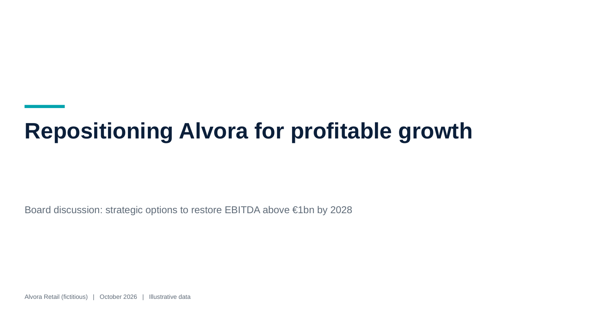

- **Layout:** `cover` — structural slide

  - [ ] Does the slide communicate ONE clear idea?
  - [ ] Is the insight understood in ~5 seconds (headline + the one highlighted element)?
  - [ ] Is there an evident visual hierarchy (headline → key number/element → support)?
  - [ ] Is every element functional (no decorative boxes, icons, colours without meaning)?
  - [ ] Does the exhibit actually prove the headline (right data, right comparison, the number is visible)?
  - [ ] Is there only one thing competing for attention (one highlight, one accent)?
  - [ ] Is the layout the right one for this message (would another family communicate better)?
  - [ ] Would a partner / MD send this slide to a client or board without edits?

## 2. s02 — exec_summary
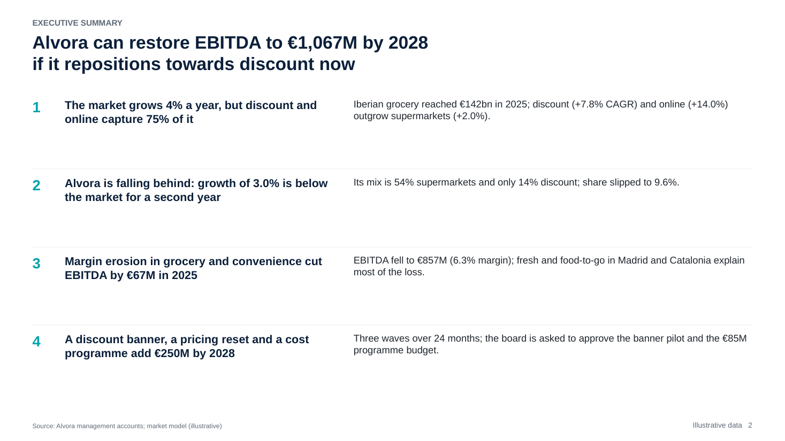

- **Headline:** Alvora can restore EBITDA to €1,067M by 2028 if it repositions towards discount now
- **Purpose:** Give the board the whole answer on one page
- **Layout:** `exec_summary_statements` — best available fit
- **Visual:** `statements` — explicit in spec

  - [ ] Does the slide communicate ONE clear idea?
  - [ ] Is the insight understood in ~5 seconds (headline + the one highlighted element)?
  - [ ] Is there an evident visual hierarchy (headline → key number/element → support)?
  - [ ] Is every element functional (no decorative boxes, icons, colours without meaning)?
  - [ ] Does the exhibit actually prove the headline (right data, right comparison, the number is visible)?
  - [ ] Is there only one thing competing for attention (one highlight, one accent)?
  - [ ] Is the layout the right one for this message (would another family communicate better)?
  - [ ] Would a partner / MD send this slide to a client or board without edits?

## 3. s03 — content
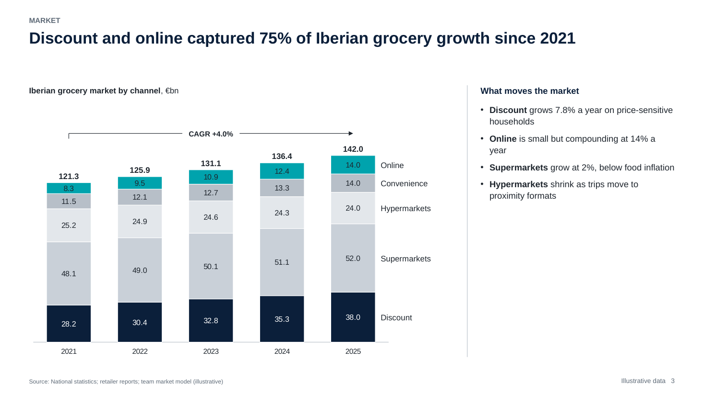

- **Headline:** Discount and online captured 75% of Iberian grocery growth since 2021
- **Purpose:** Show where market growth is coming from
- **Layout:** `exhibit_commentary_right` — best available fit
- **Visual:** `stacked_column` — explicit in spec

  - [ ] Does the slide communicate ONE clear idea?
  - [ ] Is the insight understood in ~5 seconds (headline + the one highlighted element)?
  - [ ] Is there an evident visual hierarchy (headline → key number/element → support)?
  - [ ] Is every element functional (no decorative boxes, icons, colours without meaning)?
  - [ ] Does the exhibit actually prove the headline (right data, right comparison, the number is visible)?
  - [ ] Is there only one thing competing for attention (one highlight, one accent)?
  - [ ] Is the layout the right one for this message (would another family communicate better)?
  - [ ] Would a partner / MD send this slide to a client or board without edits?

## 4. s04 — content
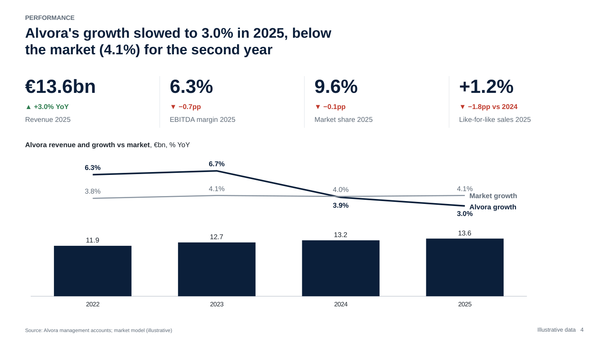

- **Headline:** Alvora's growth slowed to 3.0% in 2025, below the market (4.1%) for the second year
- **Purpose:** Show that Alvora's growth has fallen below the market
- **Layout:** `kpi_strip_exhibit` — best available fit
- **Visual:** `combo` — explicit in spec

  - [ ] Does the slide communicate ONE clear idea?
  - [ ] Is the insight understood in ~5 seconds (headline + the one highlighted element)?
  - [ ] Is there an evident visual hierarchy (headline → key number/element → support)?
  - [ ] Is every element functional (no decorative boxes, icons, colours without meaning)?
  - [ ] Does the exhibit actually prove the headline (right data, right comparison, the number is visible)?
  - [ ] Is there only one thing competing for attention (one highlight, one accent)?
  - [ ] Is the layout the right one for this message (would another family communicate better)?
  - [ ] Would a partner / MD send this slide to a client or board without edits?

## 5. s05 — content
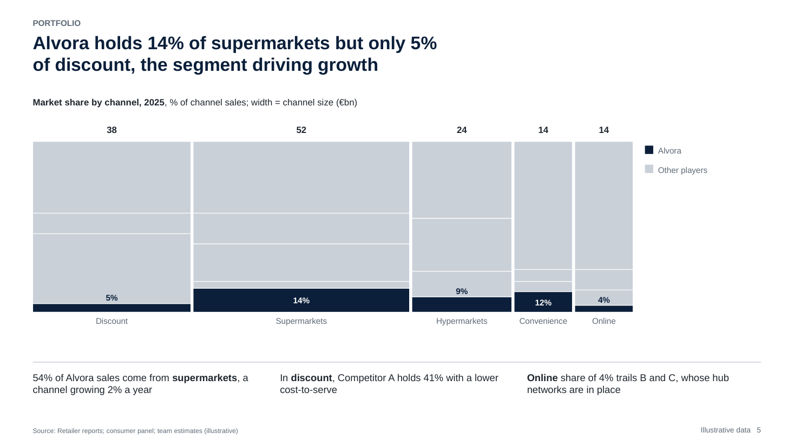

- **Headline:** Alvora holds 14% of supermarkets but only 5% of discount, the segment driving growth
- **Purpose:** Show that Alvora is weakest where the market grows
- **Layout:** `exhibit_takeaways_below` — exhibit needs the full width
- **Visual:** `mekko` — explicit in spec

  - [ ] Does the slide communicate ONE clear idea?
  - [ ] Is the insight understood in ~5 seconds (headline + the one highlighted element)?
  - [ ] Is there an evident visual hierarchy (headline → key number/element → support)?
  - [ ] Is every element functional (no decorative boxes, icons, colours without meaning)?
  - [ ] Does the exhibit actually prove the headline (right data, right comparison, the number is visible)?
  - [ ] Is there only one thing competing for attention (one highlight, one accent)?
  - [ ] Is the layout the right one for this message (would another family communicate better)?
  - [ ] Would a partner / MD send this slide to a client or board without edits?

## 6. s06 — content
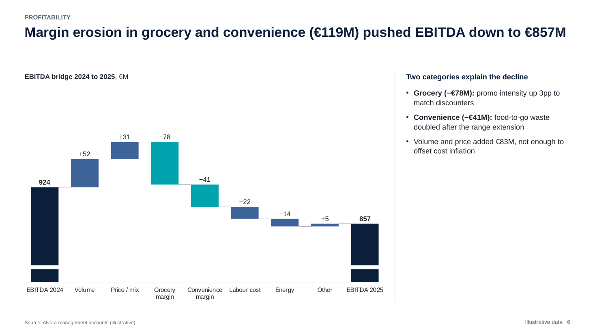

- **Headline:** Margin erosion in grocery and convenience (€119M) pushed EBITDA down to €857M
- **Purpose:** Explain what drove the EBITDA decline
- **Layout:** `waterfall_drivers` — family 09_waterfall matches waterfall
- **Visual:** `waterfall` — explicit in spec

  - [ ] Does the slide communicate ONE clear idea?
  - [ ] Is the insight understood in ~5 seconds (headline + the one highlighted element)?
  - [ ] Is there an evident visual hierarchy (headline → key number/element → support)?
  - [ ] Is every element functional (no decorative boxes, icons, colours without meaning)?
  - [ ] Does the exhibit actually prove the headline (right data, right comparison, the number is visible)?
  - [ ] Is there only one thing competing for attention (one highlight, one accent)?
  - [ ] Is the layout the right one for this message (would another family communicate better)?
  - [ ] Would a partner / MD send this slide to a client or board without edits?

## 7. s07 — content
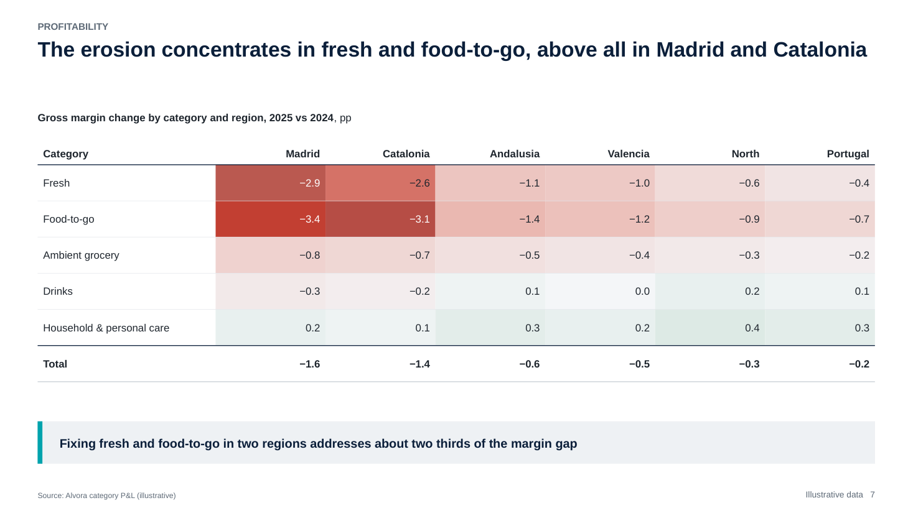

- **Headline:** The erosion concentrates in fresh and food-to-go, above all in Madrid and Catalonia
- **Purpose:** Locate the margin erosion by category and region
- **Layout:** `table_full` — family 10_table matches heatmap; exhibit needs the full width
- **Visual:** `heatmap` — explicit in spec

  - [ ] Does the slide communicate ONE clear idea?
  - [ ] Is the insight understood in ~5 seconds (headline + the one highlighted element)?
  - [ ] Is there an evident visual hierarchy (headline → key number/element → support)?
  - [ ] Is every element functional (no decorative boxes, icons, colours without meaning)?
  - [ ] Does the exhibit actually prove the headline (right data, right comparison, the number is visible)?
  - [ ] Is there only one thing competing for attention (one highlight, one accent)?
  - [ ] Is the layout the right one for this message (would another family communicate better)?
  - [ ] Would a partner / MD send this slide to a client or board without edits?

## 8. s08 — content
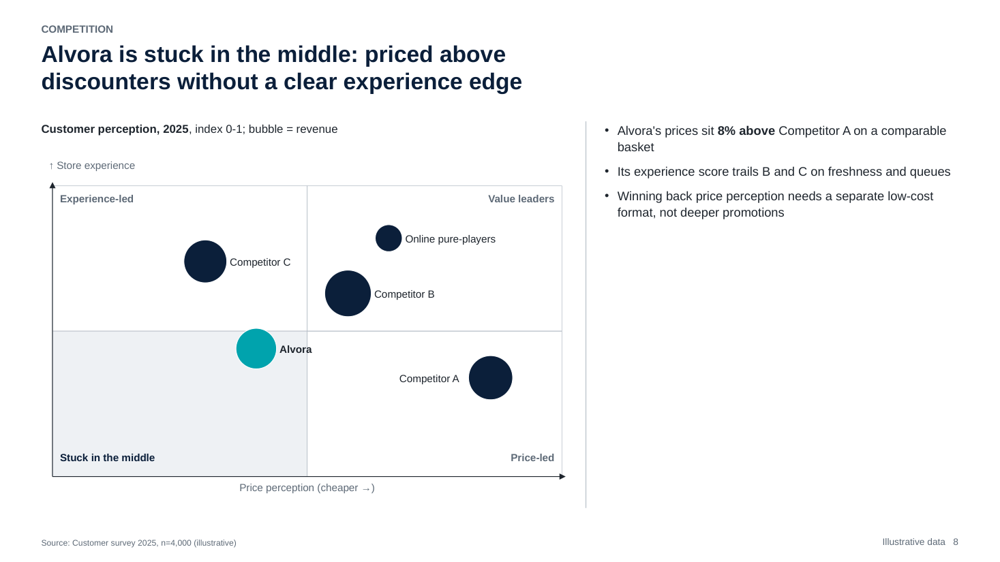

- **Headline:** Alvora is stuck in the middle: priced above discounters without a clear experience edge
- **Purpose:** Show Alvora's competitive position
- **Layout:** `matrix_commentary` — family 06_matrix matches portfolio
- **Visual:** `portfolio` — explicit in spec

  - [ ] Does the slide communicate ONE clear idea?
  - [ ] Is the insight understood in ~5 seconds (headline + the one highlighted element)?
  - [ ] Is there an evident visual hierarchy (headline → key number/element → support)?
  - [ ] Is every element functional (no decorative boxes, icons, colours without meaning)?
  - [ ] Does the exhibit actually prove the headline (right data, right comparison, the number is visible)?
  - [ ] Is there only one thing competing for attention (one highlight, one accent)?
  - [ ] Is the layout the right one for this message (would another family communicate better)?
  - [ ] Would a partner / MD send this slide to a client or board without edits?

## 9. s09 — content
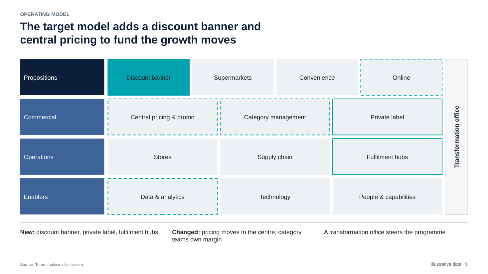

- **Headline:** The target model adds a discount banner and central pricing to fund the growth moves
- **Purpose:** Describe the target operating model and what changes
- **Layout:** `exhibit_takeaways_below` — exhibit needs the full width
- **Visual:** `operating_model` — explicit in spec

  - [ ] Does the slide communicate ONE clear idea?
  - [ ] Is the insight understood in ~5 seconds (headline + the one highlighted element)?
  - [ ] Is there an evident visual hierarchy (headline → key number/element → support)?
  - [ ] Is every element functional (no decorative boxes, icons, colours without meaning)?
  - [ ] Does the exhibit actually prove the headline (right data, right comparison, the number is visible)?
  - [ ] Is there only one thing competing for attention (one highlight, one accent)?
  - [ ] Is the layout the right one for this message (would another family communicate better)?
  - [ ] Would a partner / MD send this slide to a client or board without edits?

## 10. s10 — content
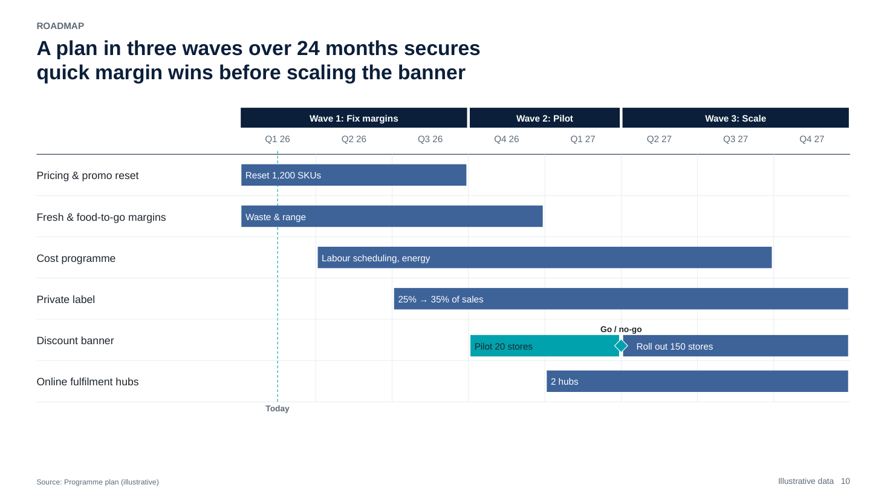

- **Headline:** A plan in three waves over 24 months secures quick margin wins before scaling the banner
- **Purpose:** Show the implementation plan and its sequencing
- **Layout:** `roadmap_full` — family 15_roadmap matches gantt; exhibit needs the full width
- **Visual:** `gantt` — explicit in spec

  - [ ] Does the slide communicate ONE clear idea?
  - [ ] Is the insight understood in ~5 seconds (headline + the one highlighted element)?
  - [ ] Is there an evident visual hierarchy (headline → key number/element → support)?
  - [ ] Is every element functional (no decorative boxes, icons, colours without meaning)?
  - [ ] Does the exhibit actually prove the headline (right data, right comparison, the number is visible)?
  - [ ] Is there only one thing competing for attention (one highlight, one accent)?
  - [ ] Is the layout the right one for this message (would another family communicate better)?
  - [ ] Would a partner / MD send this slide to a client or board without edits?

## 11. s11 — content
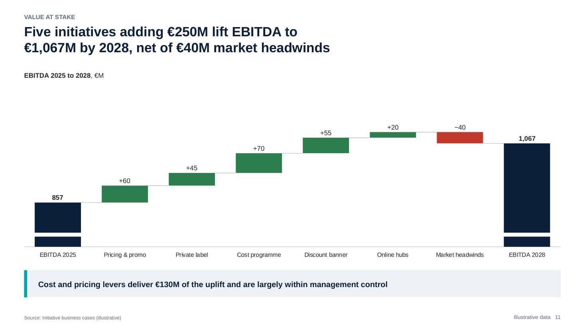

- **Headline:** Five initiatives adding €250M lift EBITDA to €1,067M by 2028, net of €40M market headwinds
- **Purpose:** Quantify the EBITDA impact of the plan
- **Layout:** `waterfall_full` — family 09_waterfall matches waterfall
- **Visual:** `waterfall` — explicit in spec

  - [ ] Does the slide communicate ONE clear idea?
  - [ ] Is the insight understood in ~5 seconds (headline + the one highlighted element)?
  - [ ] Is there an evident visual hierarchy (headline → key number/element → support)?
  - [ ] Is every element functional (no decorative boxes, icons, colours without meaning)?
  - [ ] Does the exhibit actually prove the headline (right data, right comparison, the number is visible)?
  - [ ] Is there only one thing competing for attention (one highlight, one accent)?
  - [ ] Is the layout the right one for this message (would another family communicate better)?
  - [ ] Would a partner / MD send this slide to a client or board without edits?

## 12. s12 — content
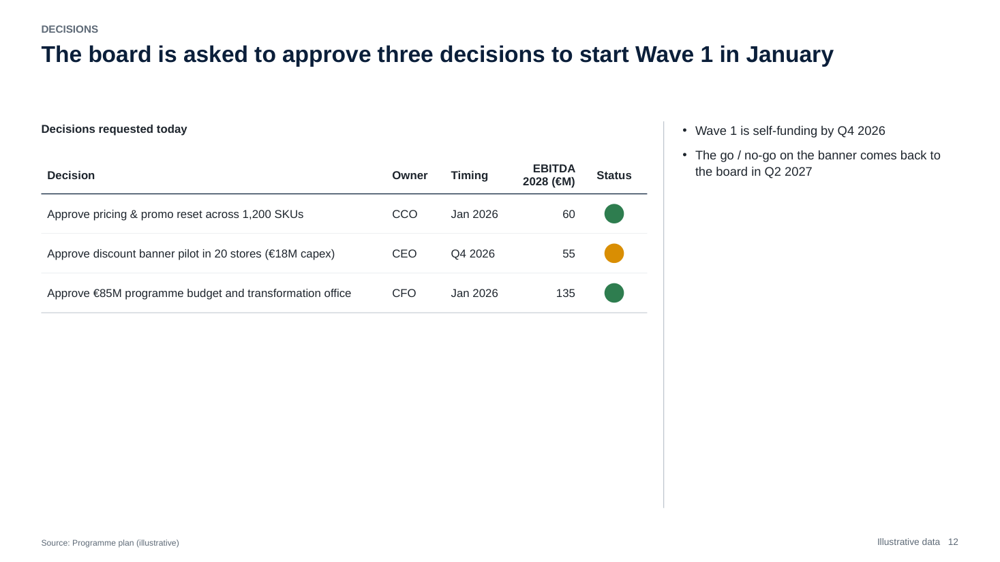

- **Headline:** The board is asked to approve three decisions to start Wave 1 in January
- **Purpose:** Make the ask explicit
- **Layout:** `table_commentary` — family 10_table matches table
- **Visual:** `table` — explicit in spec

  - [ ] Does the slide communicate ONE clear idea?
  - [ ] Is the insight understood in ~5 seconds (headline + the one highlighted element)?
  - [ ] Is there an evident visual hierarchy (headline → key number/element → support)?
  - [ ] Is every element functional (no decorative boxes, icons, colours without meaning)?
  - [ ] Does the exhibit actually prove the headline (right data, right comparison, the number is visible)?
  - [ ] Is there only one thing competing for attention (one highlight, one accent)?
  - [ ] Is the layout the right one for this message (would another family communicate better)?
  - [ ] Would a partner / MD send this slide to a client or board without edits?

