# Visual review packet

Open each PNG, answer the questions (0 = no, 1 = partly, 2 = yes), and write
`review.json` + `patches.json` (see SKILL.md §8). A slide passes the review with ≥13/16 and no 0.

**Lenses (whole deck):** *CEO / board*: Is it a decision or just a description? What is the ask? · *CFO*: Do numbers, units, periods and deltas reconcile across slides? · *Engagement partner*: Is the answer sharp and defensible? What is the weakest claim? · *Visual editor*: What does the eye see first, second, third? Anything to remove?

## 1. g01 — cover
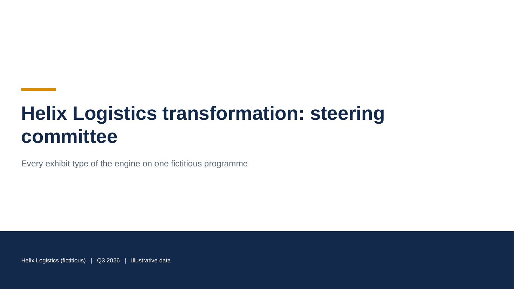

- **Layout:** `cover` — structural slide

  - [ ] Does the slide communicate ONE clear idea?
  - [ ] Is the insight understood in ~5 seconds (headline + the one highlighted element)?
  - [ ] Is there an evident visual hierarchy (headline → key number/element → support)?
  - [ ] Is every element functional (no decorative boxes, icons, colours without meaning)?
  - [ ] Does the exhibit actually prove the headline (right data, right comparison, the number is visible)?
  - [ ] Is there only one thing competing for attention (one highlight, one accent)?
  - [ ] Is the layout the right one for this message (would another family communicate better)?
  - [ ] Would a partner / MD send this slide to a client or board without edits?

## 2. g02 — agenda
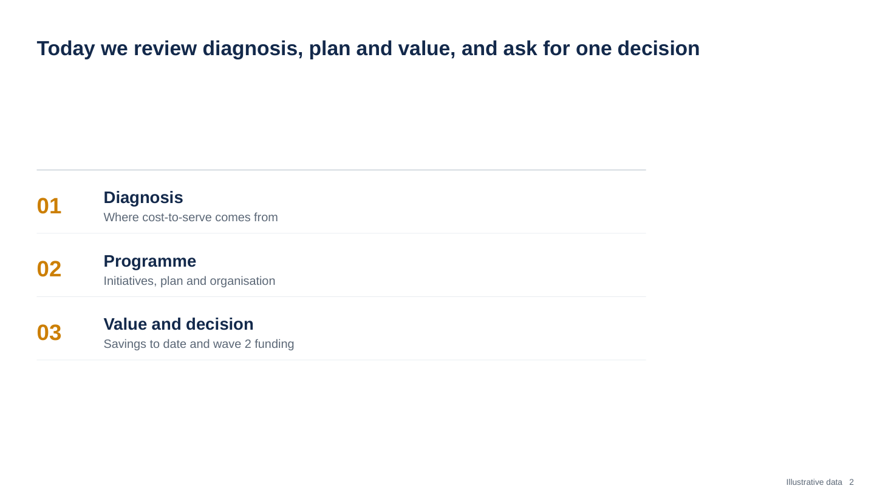

- **Headline:** Today we review diagnosis, plan and value, and ask for one decision
- **Layout:** `agenda` — structural slide

  - [ ] Does the slide communicate ONE clear idea?
  - [ ] Is the insight understood in ~5 seconds (headline + the one highlighted element)?
  - [ ] Is there an evident visual hierarchy (headline → key number/element → support)?
  - [ ] Is every element functional (no decorative boxes, icons, colours without meaning)?
  - [ ] Does the exhibit actually prove the headline (right data, right comparison, the number is visible)?
  - [ ] Is there only one thing competing for attention (one highlight, one accent)?
  - [ ] Is the layout the right one for this message (would another family communicate better)?
  - [ ] Would a partner / MD send this slide to a client or board without edits?

## 3. g03 — exec_summary
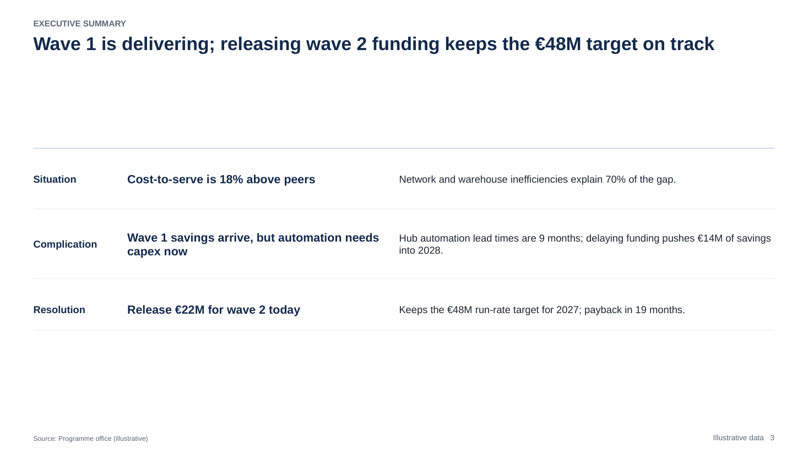

- **Headline:** Wave 1 is delivering; releasing wave 2 funding keeps the €48M target on track
- **Purpose:** Frame the decision
- **Layout:** `exec_summary_scr` — best available fit
- **Visual:** `statements` — explicit in spec

  - [ ] Does the slide communicate ONE clear idea?
  - [ ] Is the insight understood in ~5 seconds (headline + the one highlighted element)?
  - [ ] Is there an evident visual hierarchy (headline → key number/element → support)?
  - [ ] Is every element functional (no decorative boxes, icons, colours without meaning)?
  - [ ] Does the exhibit actually prove the headline (right data, right comparison, the number is visible)?
  - [ ] Is there only one thing competing for attention (one highlight, one accent)?
  - [ ] Is the layout the right one for this message (would another family communicate better)?
  - [ ] Would a partner / MD send this slide to a client or board without edits?

## 4. g04 — divider

- **Layout:** `divider` — structural slide

  - [ ] Does the slide communicate ONE clear idea?
  - [ ] Is the insight understood in ~5 seconds (headline + the one highlighted element)?
  - [ ] Is there an evident visual hierarchy (headline → key number/element → support)?
  - [ ] Is every element functional (no decorative boxes, icons, colours without meaning)?
  - [ ] Does the exhibit actually prove the headline (right data, right comparison, the number is visible)?
  - [ ] Is there only one thing competing for attention (one highlight, one accent)?
  - [ ] Is the layout the right one for this message (would another family communicate better)?
  - [ ] Would a partner / MD send this slide to a client or board without edits?

## 5. g05 — content
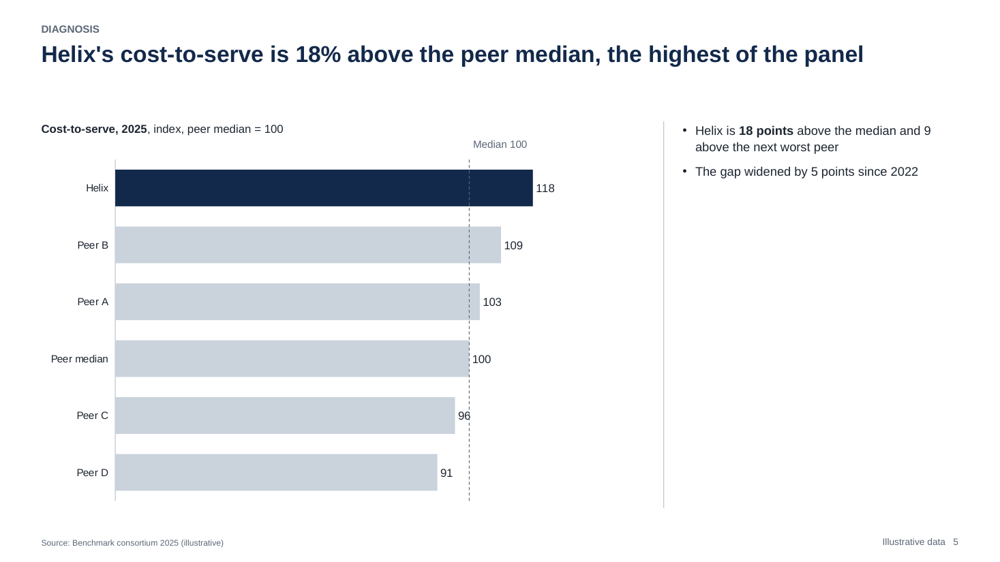

- **Headline:** Helix's cost-to-serve is 18% above the peer median, the highest of the panel
- **Purpose:** Size the gap
- **Layout:** `exhibit_commentary_right` — explicit in spec
- **Visual:** `bar` — explicit in spec

  - [ ] Does the slide communicate ONE clear idea?
  - [ ] Is the insight understood in ~5 seconds (headline + the one highlighted element)?
  - [ ] Is there an evident visual hierarchy (headline → key number/element → support)?
  - [ ] Is every element functional (no decorative boxes, icons, colours without meaning)?
  - [ ] Does the exhibit actually prove the headline (right data, right comparison, the number is visible)?
  - [ ] Is there only one thing competing for attention (one highlight, one accent)?
  - [ ] Is the layout the right one for this message (would another family communicate better)?
  - [ ] Would a partner / MD send this slide to a client or board without edits?

## 6. g06 — content
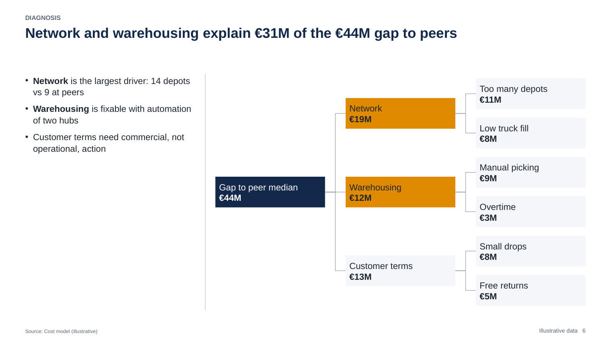

- **Headline:** Network and warehousing explain €31M of the €44M gap to peers
- **Purpose:** Decompose cost-to-serve
- **Layout:** `framework_commentary` — explicit in spec
- **Visual:** `driver_tree` — explicit in spec

  - [ ] Does the slide communicate ONE clear idea?
  - [ ] Is the insight understood in ~5 seconds (headline + the one highlighted element)?
  - [ ] Is there an evident visual hierarchy (headline → key number/element → support)?
  - [ ] Is every element functional (no decorative boxes, icons, colours without meaning)?
  - [ ] Does the exhibit actually prove the headline (right data, right comparison, the number is visible)?
  - [ ] Is there only one thing competing for attention (one highlight, one accent)?
  - [ ] Is the layout the right one for this message (would another family communicate better)?
  - [ ] Would a partner / MD send this slide to a client or board without edits?

## 7. g07 — content
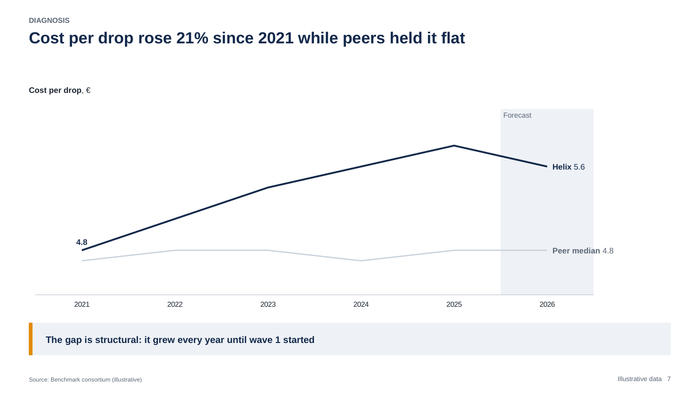

- **Headline:** Cost per drop rose 21% since 2021 while peers held it flat
- **Purpose:** Show the trend
- **Layout:** `exhibit_full` — best available fit
- **Visual:** `line` — explicit in spec

  - [ ] Does the slide communicate ONE clear idea?
  - [ ] Is the insight understood in ~5 seconds (headline + the one highlighted element)?
  - [ ] Is there an evident visual hierarchy (headline → key number/element → support)?
  - [ ] Is every element functional (no decorative boxes, icons, colours without meaning)?
  - [ ] Does the exhibit actually prove the headline (right data, right comparison, the number is visible)?
  - [ ] Is there only one thing competing for attention (one highlight, one accent)?
  - [ ] Is the layout the right one for this message (would another family communicate better)?
  - [ ] Would a partner / MD send this slide to a client or board without edits?

## 8. g08 — content
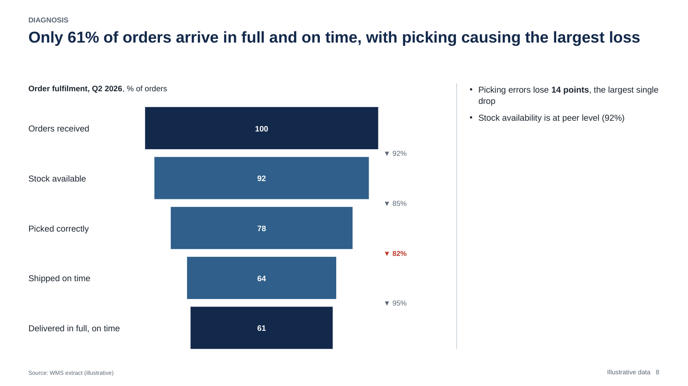

- **Headline:** Only 61% of orders arrive in full and on time, with picking causing the largest loss
- **Purpose:** Show where volume goes
- **Layout:** `process_commentary` — explicit in spec
- **Visual:** `funnel` — explicit in spec

  - [ ] Does the slide communicate ONE clear idea?
  - [ ] Is the insight understood in ~5 seconds (headline + the one highlighted element)?
  - [ ] Is there an evident visual hierarchy (headline → key number/element → support)?
  - [ ] Is every element functional (no decorative boxes, icons, colours without meaning)?
  - [ ] Does the exhibit actually prove the headline (right data, right comparison, the number is visible)?
  - [ ] Is there only one thing competing for attention (one highlight, one accent)?
  - [ ] Is the layout the right one for this message (would another family communicate better)?
  - [ ] Would a partner / MD send this slide to a client or board without edits?

## 9. g09 — content
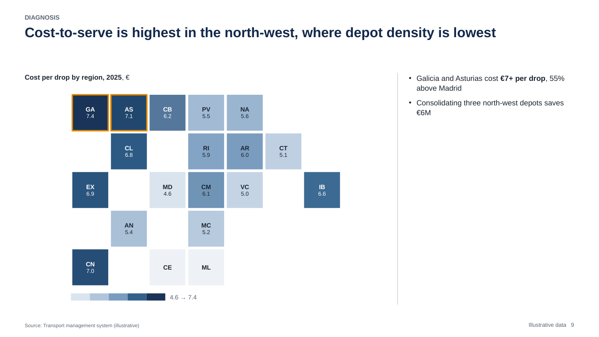

- **Headline:** Cost-to-serve is highest in the north-west, where depot density is lowest
- **Purpose:** Show the geography
- **Layout:** `exhibit_takeaways_below` — explicit in spec
- **Visual:** `tile_map` — explicit in spec

  - [ ] Does the slide communicate ONE clear idea?
  - [ ] Is the insight understood in ~5 seconds (headline + the one highlighted element)?
  - [ ] Is there an evident visual hierarchy (headline → key number/element → support)?
  - [ ] Is every element functional (no decorative boxes, icons, colours without meaning)?
  - [ ] Does the exhibit actually prove the headline (right data, right comparison, the number is visible)?
  - [ ] Is there only one thing competing for attention (one highlight, one accent)?
  - [ ] Is the layout the right one for this message (would another family communicate better)?
  - [ ] Would a partner / MD send this slide to a client or board without edits?

## 10. g10 — content
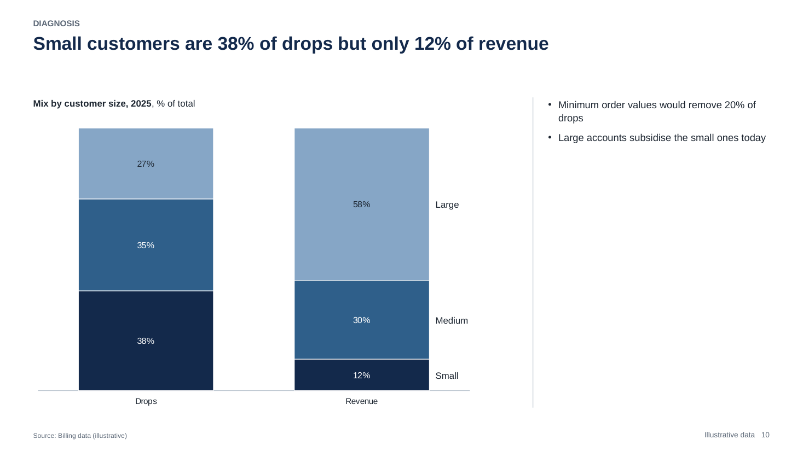

- **Headline:** Small customers are 38% of drops but only 12% of revenue
- **Purpose:** Show customer mix
- **Layout:** `exhibit_commentary_right` — explicit in spec
- **Visual:** `stacked_100` — explicit in spec

  - [ ] Does the slide communicate ONE clear idea?
  - [ ] Is the insight understood in ~5 seconds (headline + the one highlighted element)?
  - [ ] Is there an evident visual hierarchy (headline → key number/element → support)?
  - [ ] Is every element functional (no decorative boxes, icons, colours without meaning)?
  - [ ] Does the exhibit actually prove the headline (right data, right comparison, the number is visible)?
  - [ ] Is there only one thing competing for attention (one highlight, one accent)?
  - [ ] Is the layout the right one for this message (would another family communicate better)?
  - [ ] Would a partner / MD send this slide to a client or board without edits?

## 11. g11 — content
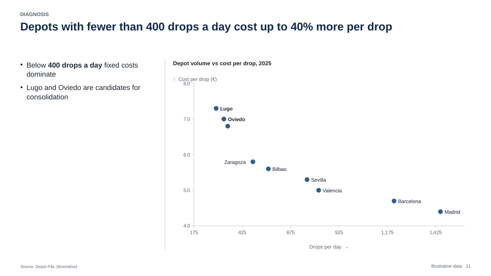

- **Headline:** Depots with fewer than 400 drops a day cost up to 40% more per drop
- **Purpose:** Show relationship
- **Layout:** `exhibit_commentary_left` — explicit in spec
- **Visual:** `scatter` — explicit in spec

  - [ ] Does the slide communicate ONE clear idea?
  - [ ] Is the insight understood in ~5 seconds (headline + the one highlighted element)?
  - [ ] Is there an evident visual hierarchy (headline → key number/element → support)?
  - [ ] Is every element functional (no decorative boxes, icons, colours without meaning)?
  - [ ] Does the exhibit actually prove the headline (right data, right comparison, the number is visible)?
  - [ ] Is there only one thing competing for attention (one highlight, one accent)?
  - [ ] Is the layout the right one for this message (would another family communicate better)?
  - [ ] Would a partner / MD send this slide to a client or board without edits?

## 12. g12 — divider

- **Layout:** `divider` — structural slide

  - [ ] Does the slide communicate ONE clear idea?
  - [ ] Is the insight understood in ~5 seconds (headline + the one highlighted element)?
  - [ ] Is there an evident visual hierarchy (headline → key number/element → support)?
  - [ ] Is every element functional (no decorative boxes, icons, colours without meaning)?
  - [ ] Does the exhibit actually prove the headline (right data, right comparison, the number is visible)?
  - [ ] Is there only one thing competing for attention (one highlight, one accent)?
  - [ ] Is the layout the right one for this message (would another family communicate better)?
  - [ ] Would a partner / MD send this slide to a client or board without edits?

## 13. g13 — content
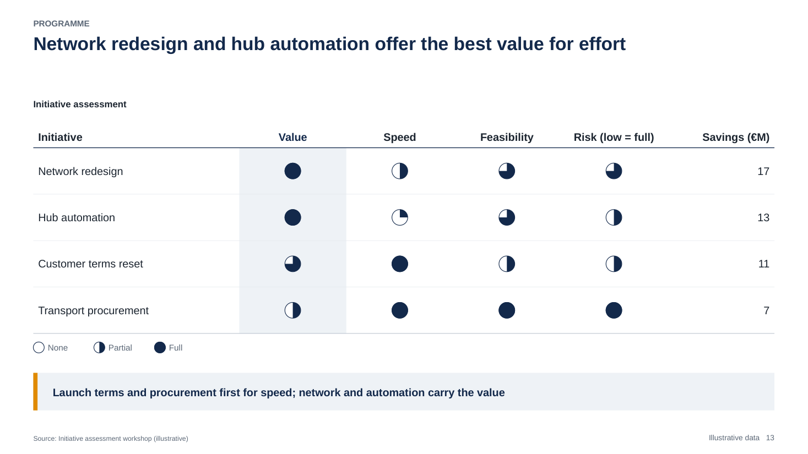

- **Headline:** Network redesign and hub automation offer the best value for effort
- **Purpose:** Compare initiatives
- **Layout:** `comparison_table` — explicit in spec
- **Visual:** `harvey_table` — explicit in spec

  - [ ] Does the slide communicate ONE clear idea?
  - [ ] Is the insight understood in ~5 seconds (headline + the one highlighted element)?
  - [ ] Is there an evident visual hierarchy (headline → key number/element → support)?
  - [ ] Is every element functional (no decorative boxes, icons, colours without meaning)?
  - [ ] Does the exhibit actually prove the headline (right data, right comparison, the number is visible)?
  - [ ] Is there only one thing competing for attention (one highlight, one accent)?
  - [ ] Is the layout the right one for this message (would another family communicate better)?
  - [ ] Would a partner / MD send this slide to a client or board without edits?

## 14. g14 — content
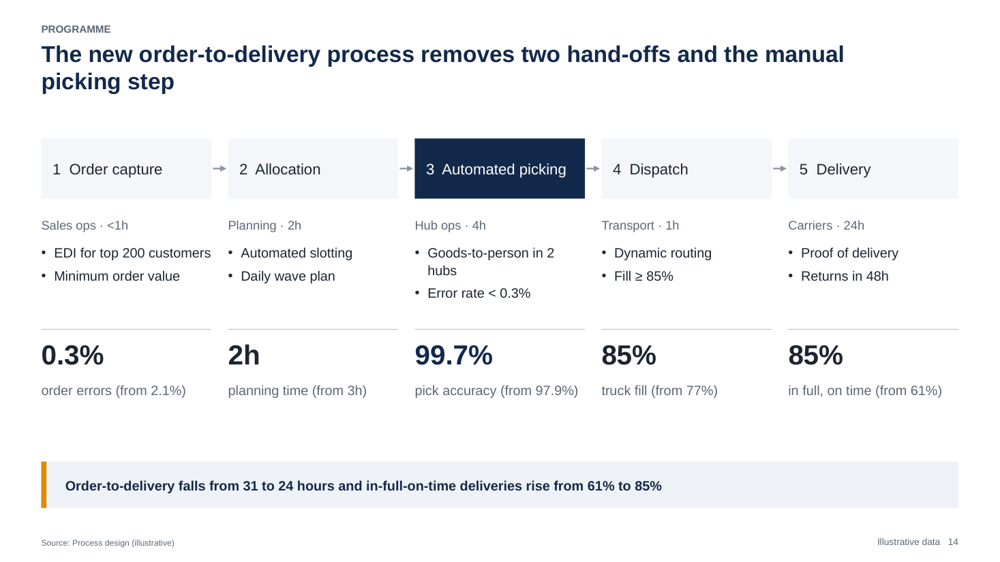

- **Headline:** The new order-to-delivery process removes two hand-offs and the manual picking step
- **Purpose:** Show the operating process
- **Layout:** `process_full` — explicit in spec
- **Visual:** `process` — explicit in spec

  - [ ] Does the slide communicate ONE clear idea?
  - [ ] Is the insight understood in ~5 seconds (headline + the one highlighted element)?
  - [ ] Is there an evident visual hierarchy (headline → key number/element → support)?
  - [ ] Is every element functional (no decorative boxes, icons, colours without meaning)?
  - [ ] Does the exhibit actually prove the headline (right data, right comparison, the number is visible)?
  - [ ] Is there only one thing competing for attention (one highlight, one accent)?
  - [ ] Is the layout the right one for this message (would another family communicate better)?
  - [ ] Would a partner / MD send this slide to a client or board without edits?

## 15. g15 — content
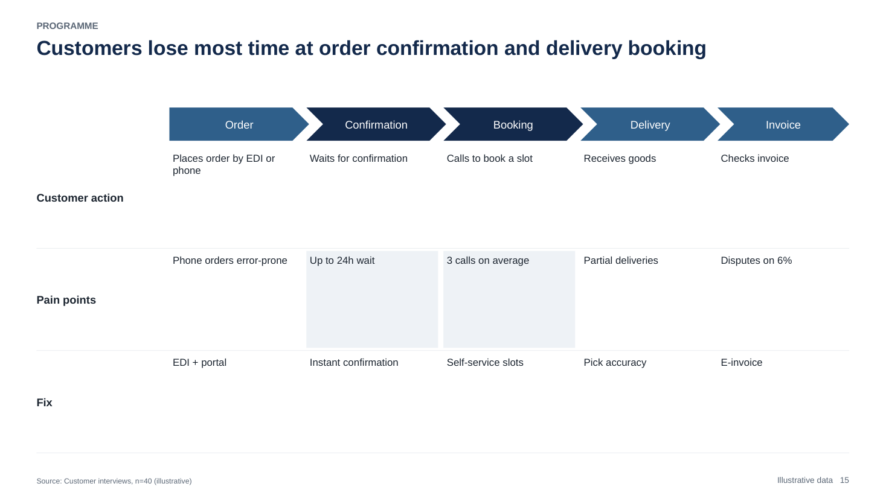

- **Headline:** Customers lose most time at order confirmation and delivery booking
- **Purpose:** Show the customer journey
- **Layout:** `exhibit_full` — explicit in spec
- **Visual:** `journey` — explicit in spec

  - [ ] Does the slide communicate ONE clear idea?
  - [ ] Is the insight understood in ~5 seconds (headline + the one highlighted element)?
  - [ ] Is there an evident visual hierarchy (headline → key number/element → support)?
  - [ ] Is every element functional (no decorative boxes, icons, colours without meaning)?
  - [ ] Does the exhibit actually prove the headline (right data, right comparison, the number is visible)?
  - [ ] Is there only one thing competing for attention (one highlight, one accent)?
  - [ ] Is the layout the right one for this message (would another family communicate better)?
  - [ ] Would a partner / MD send this slide to a client or board without edits?

## 16. g16 — content
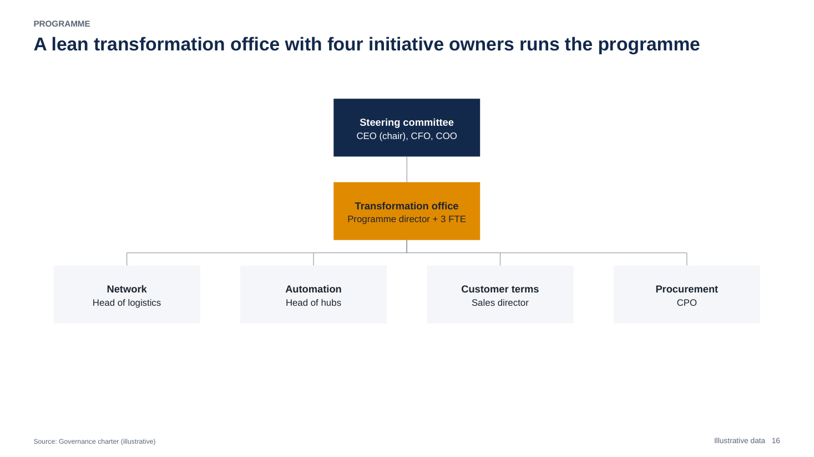

- **Headline:** A lean transformation office with four initiative owners runs the programme
- **Purpose:** Show organisation
- **Layout:** `architecture_full` — explicit in spec
- **Visual:** `org_chart` — explicit in spec

  - [ ] Does the slide communicate ONE clear idea?
  - [ ] Is the insight understood in ~5 seconds (headline + the one highlighted element)?
  - [ ] Is there an evident visual hierarchy (headline → key number/element → support)?
  - [ ] Is every element functional (no decorative boxes, icons, colours without meaning)?
  - [ ] Does the exhibit actually prove the headline (right data, right comparison, the number is visible)?
  - [ ] Is there only one thing competing for attention (one highlight, one accent)?
  - [ ] Is the layout the right one for this message (would another family communicate better)?
  - [ ] Would a partner / MD send this slide to a client or board without edits?

## 17. g17 — content
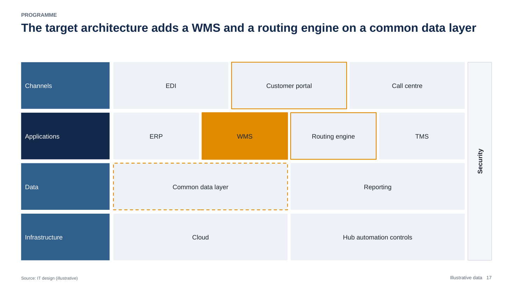

- **Headline:** The target architecture adds a WMS and a routing engine on a common data layer
- **Purpose:** Show the target architecture
- **Layout:** `architecture_full` — explicit in spec
- **Visual:** `architecture` — explicit in spec

  - [ ] Does the slide communicate ONE clear idea?
  - [ ] Is the insight understood in ~5 seconds (headline + the one highlighted element)?
  - [ ] Is there an evident visual hierarchy (headline → key number/element → support)?
  - [ ] Is every element functional (no decorative boxes, icons, colours without meaning)?
  - [ ] Does the exhibit actually prove the headline (right data, right comparison, the number is visible)?
  - [ ] Is there only one thing competing for attention (one highlight, one accent)?
  - [ ] Is the layout the right one for this message (would another family communicate better)?
  - [ ] Would a partner / MD send this slide to a client or board without edits?

## 18. g18 — content
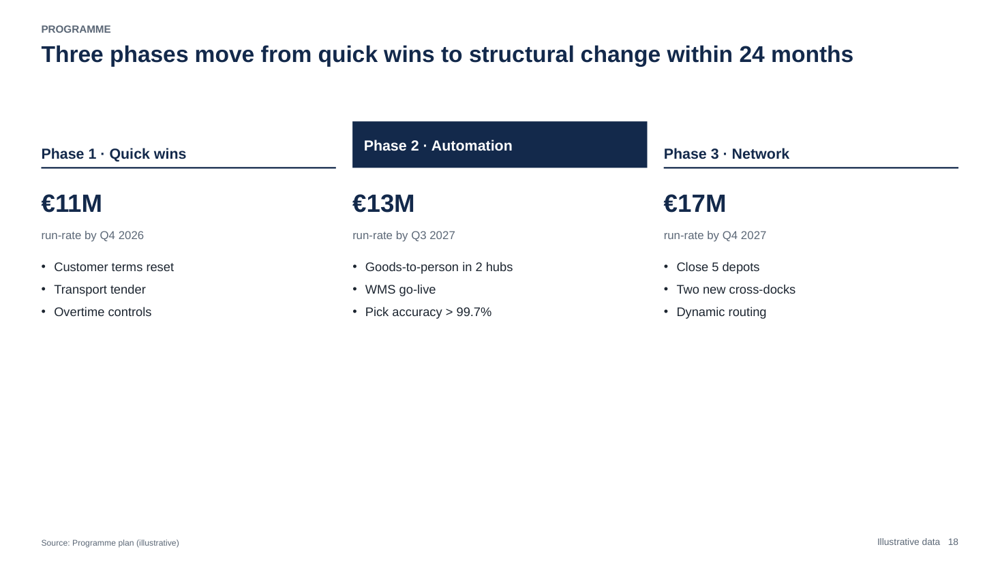

- **Headline:** Three phases move from quick wins to structural change within 24 months
- **Purpose:** Show the phases
- **Layout:** `roadmap_phases` — explicit in spec

  - [ ] Does the slide communicate ONE clear idea?
  - [ ] Is the insight understood in ~5 seconds (headline + the one highlighted element)?
  - [ ] Is there an evident visual hierarchy (headline → key number/element → support)?
  - [ ] Is every element functional (no decorative boxes, icons, colours without meaning)?
  - [ ] Does the exhibit actually prove the headline (right data, right comparison, the number is visible)?
  - [ ] Is there only one thing competing for attention (one highlight, one accent)?
  - [ ] Is the layout the right one for this message (would another family communicate better)?
  - [ ] Would a partner / MD send this slide to a client or board without edits?

## 19. g19 — content
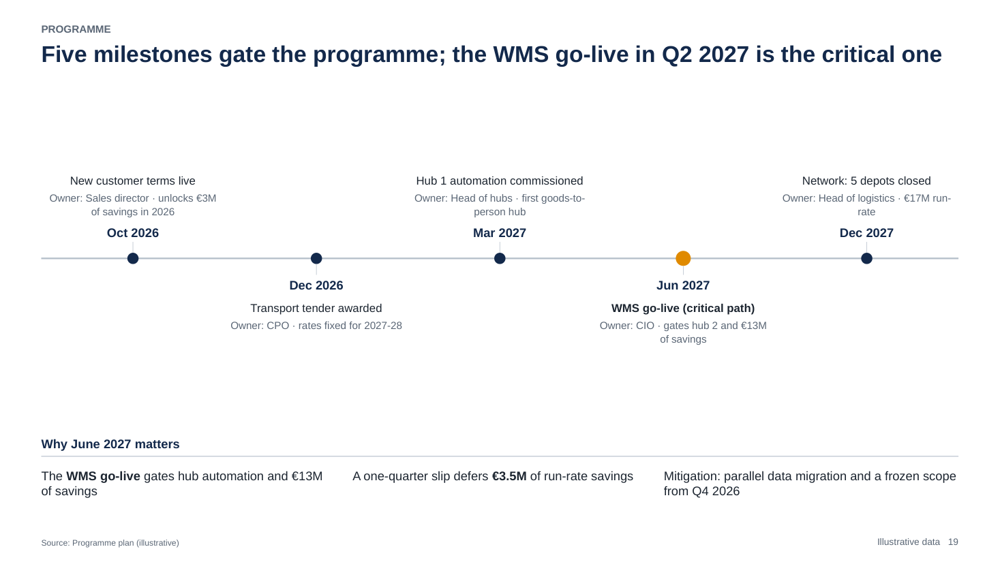

- **Headline:** Five milestones gate the programme; the WMS go-live in Q2 2027 is the critical one
- **Purpose:** Show milestones
- **Layout:** `exhibit_takeaways_below` — explicit in spec
- **Visual:** `timeline` — explicit in spec

  - [ ] Does the slide communicate ONE clear idea?
  - [ ] Is the insight understood in ~5 seconds (headline + the one highlighted element)?
  - [ ] Is there an evident visual hierarchy (headline → key number/element → support)?
  - [ ] Is every element functional (no decorative boxes, icons, colours without meaning)?
  - [ ] Does the exhibit actually prove the headline (right data, right comparison, the number is visible)?
  - [ ] Is there only one thing competing for attention (one highlight, one accent)?
  - [ ] Is the layout the right one for this message (would another family communicate better)?
  - [ ] Would a partner / MD send this slide to a client or board without edits?

## 20. g20 — divider

- **Layout:** `divider` — structural slide

  - [ ] Does the slide communicate ONE clear idea?
  - [ ] Is the insight understood in ~5 seconds (headline + the one highlighted element)?
  - [ ] Is there an evident visual hierarchy (headline → key number/element → support)?
  - [ ] Is every element functional (no decorative boxes, icons, colours without meaning)?
  - [ ] Does the exhibit actually prove the headline (right data, right comparison, the number is visible)?
  - [ ] Is there only one thing competing for attention (one highlight, one accent)?
  - [ ] Is the layout the right one for this message (would another family communicate better)?
  - [ ] Would a partner / MD send this slide to a client or board without edits?

## 21. g21 — content
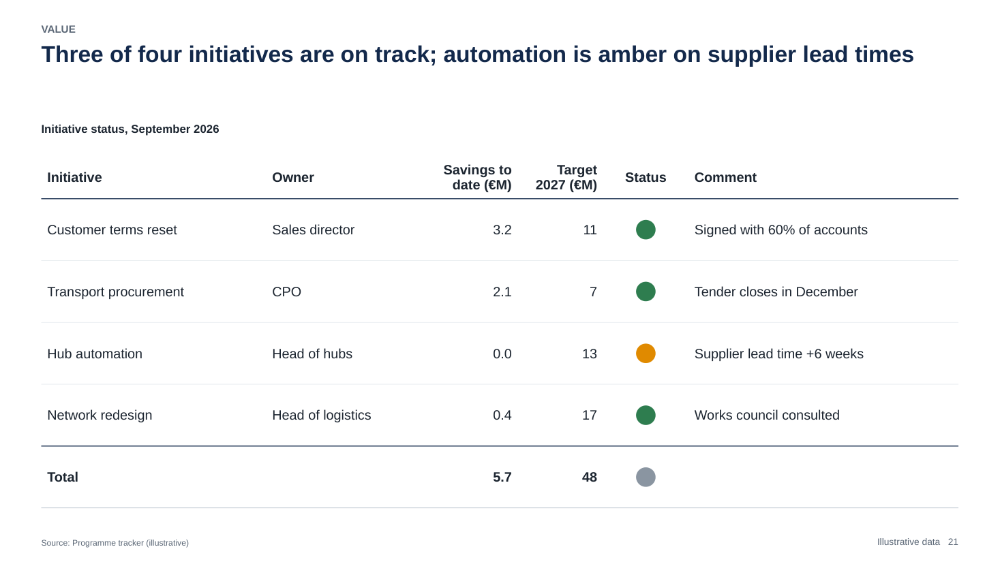

- **Headline:** Three of four initiatives are on track; automation is amber on supplier lead times
- **Purpose:** Show status of initiatives
- **Layout:** `table_full` — explicit in spec
- **Visual:** `scorecard` — explicit in spec

  - [ ] Does the slide communicate ONE clear idea?
  - [ ] Is the insight understood in ~5 seconds (headline + the one highlighted element)?
  - [ ] Is there an evident visual hierarchy (headline → key number/element → support)?
  - [ ] Is every element functional (no decorative boxes, icons, colours without meaning)?
  - [ ] Does the exhibit actually prove the headline (right data, right comparison, the number is visible)?
  - [ ] Is there only one thing competing for attention (one highlight, one accent)?
  - [ ] Is the layout the right one for this message (would another family communicate better)?
  - [ ] Would a partner / MD send this slide to a client or board without edits?

## 22. g22 — content
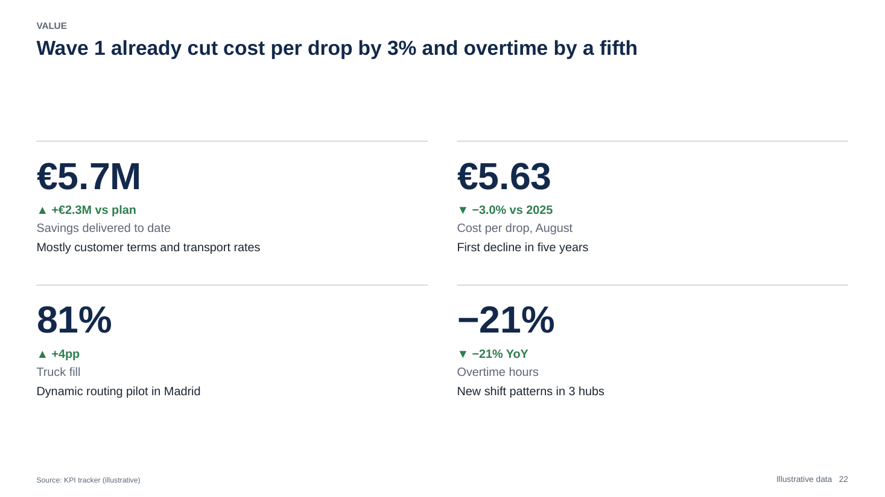

- **Headline:** Wave 1 already cut cost per drop by 3% and overtime by a fifth
- **Purpose:** Show KPIs
- **Layout:** `kpi_grid` — best available fit
- **Visual:** `kpi` — explicit in spec

  - [ ] Does the slide communicate ONE clear idea?
  - [ ] Is the insight understood in ~5 seconds (headline + the one highlighted element)?
  - [ ] Is there an evident visual hierarchy (headline → key number/element → support)?
  - [ ] Is every element functional (no decorative boxes, icons, colours without meaning)?
  - [ ] Does the exhibit actually prove the headline (right data, right comparison, the number is visible)?
  - [ ] Is there only one thing competing for attention (one highlight, one accent)?
  - [ ] Is the layout the right one for this message (would another family communicate better)?
  - [ ] Would a partner / MD send this slide to a client or board without edits?

## 23. g23 — content
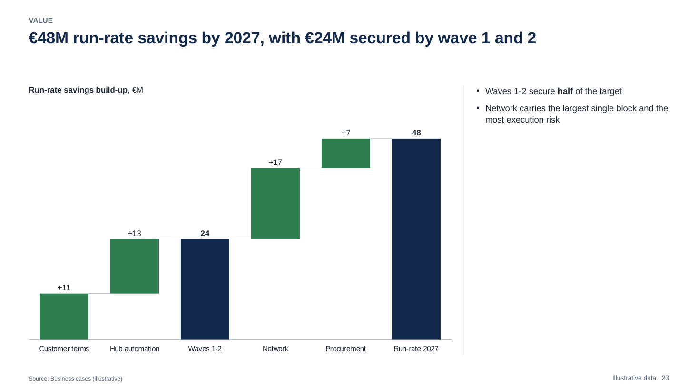

- **Headline:** €48M run-rate savings by 2027, with €24M secured by wave 1 and 2
- **Purpose:** Bridge savings
- **Layout:** `exhibit_takeaways_below` — explicit in spec
- **Visual:** `bridge` — explicit in spec

  - [ ] Does the slide communicate ONE clear idea?
  - [ ] Is the insight understood in ~5 seconds (headline + the one highlighted element)?
  - [ ] Is there an evident visual hierarchy (headline → key number/element → support)?
  - [ ] Is every element functional (no decorative boxes, icons, colours without meaning)?
  - [ ] Does the exhibit actually prove the headline (right data, right comparison, the number is visible)?
  - [ ] Is there only one thing competing for attention (one highlight, one accent)?
  - [ ] Is the layout the right one for this message (would another family communicate better)?
  - [ ] Would a partner / MD send this slide to a client or board without edits?

## 24. g24 — content
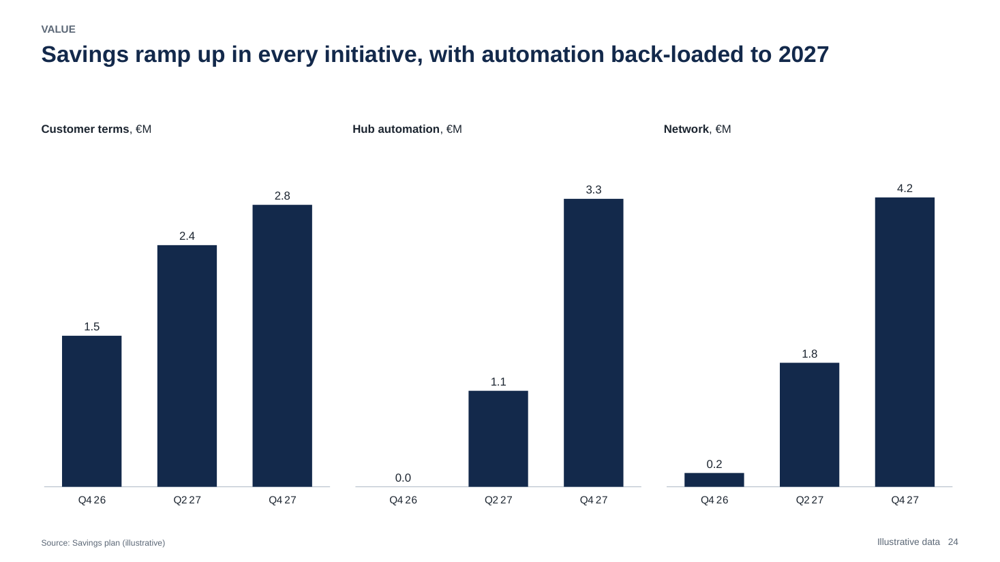

- **Headline:** Savings ramp up in every initiative, with automation back-loaded to 2027
- **Purpose:** Small multiples of savings by quarter
- **Layout:** `exhibit_trio` — best available fit
- **Visual:** `column` — explicit in spec
- **Visual:** `column` — explicit in spec
- **Visual:** `column` — explicit in spec

  - [ ] Does the slide communicate ONE clear idea?
  - [ ] Is the insight understood in ~5 seconds (headline + the one highlighted element)?
  - [ ] Is there an evident visual hierarchy (headline → key number/element → support)?
  - [ ] Is every element functional (no decorative boxes, icons, colours without meaning)?
  - [ ] Does the exhibit actually prove the headline (right data, right comparison, the number is visible)?
  - [ ] Is there only one thing competing for attention (one highlight, one accent)?
  - [ ] Is the layout the right one for this message (would another family communicate better)?
  - [ ] Would a partner / MD send this slide to a client or board without edits?

## 25. g25 — content
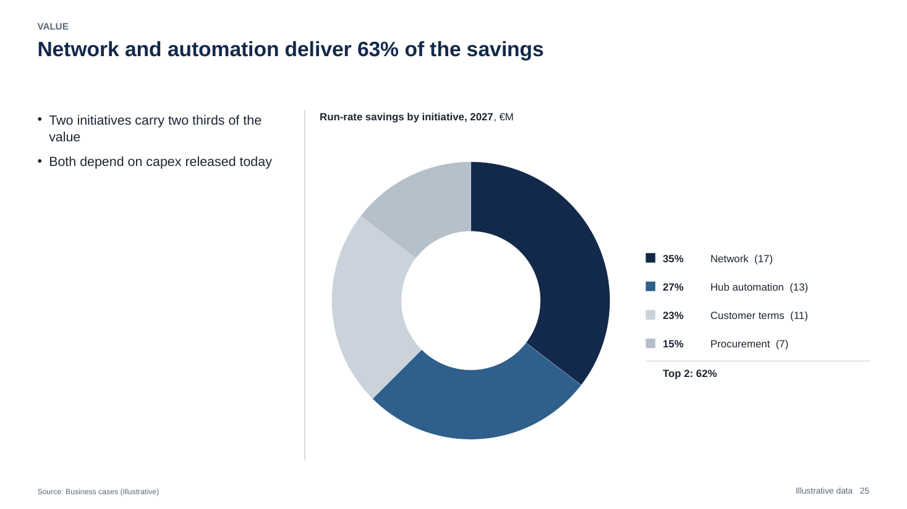

- **Headline:** Network and automation deliver 63% of the savings
- **Purpose:** Share of savings
- **Layout:** `exhibit_commentary_left` — explicit in spec
- **Visual:** `donut` — explicit in spec

  - [ ] Does the slide communicate ONE clear idea?
  - [ ] Is the insight understood in ~5 seconds (headline + the one highlighted element)?
  - [ ] Is there an evident visual hierarchy (headline → key number/element → support)?
  - [ ] Is every element functional (no decorative boxes, icons, colours without meaning)?
  - [ ] Does the exhibit actually prove the headline (right data, right comparison, the number is visible)?
  - [ ] Is there only one thing competing for attention (one highlight, one accent)?
  - [ ] Is the layout the right one for this message (would another family communicate better)?
  - [ ] Would a partner / MD send this slide to a client or board without edits?

## 26. g26 — statement
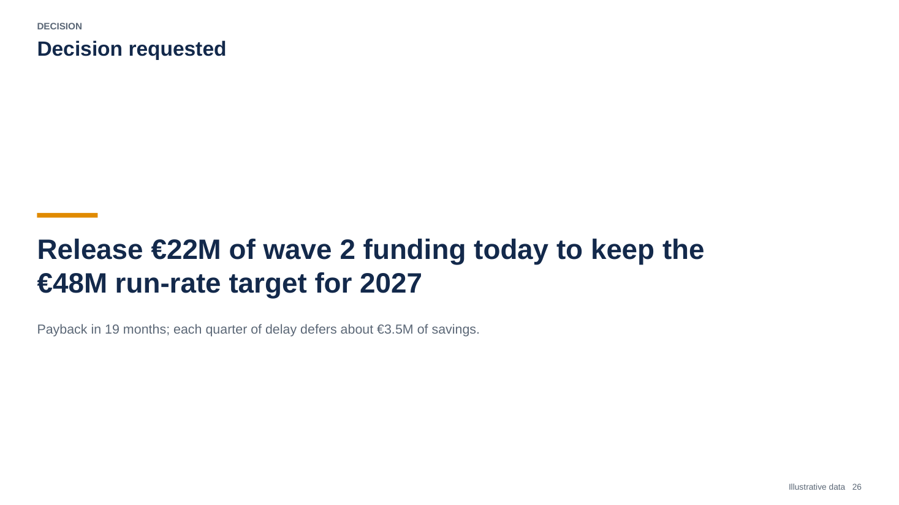

- **Headline:** Decision requested
- **Layout:** `statement` — statement slide

  - [ ] Does the slide communicate ONE clear idea?
  - [ ] Is the insight understood in ~5 seconds (headline + the one highlighted element)?
  - [ ] Is there an evident visual hierarchy (headline → key number/element → support)?
  - [ ] Is every element functional (no decorative boxes, icons, colours without meaning)?
  - [ ] Does the exhibit actually prove the headline (right data, right comparison, the number is visible)?
  - [ ] Is there only one thing competing for attention (one highlight, one accent)?
  - [ ] Is the layout the right one for this message (would another family communicate better)?
  - [ ] Would a partner / MD send this slide to a client or board without edits?

